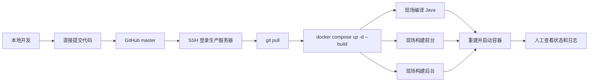
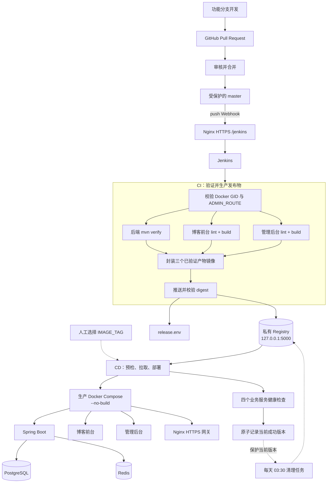
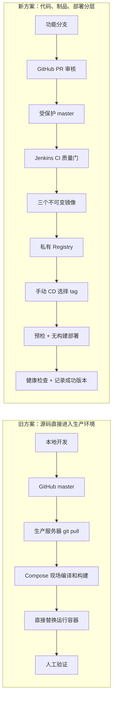

# 从 `git pull` 到 Jenkins 流水线：MyBlog CI/CD 学习实验记录

> 本文记录 MyBlog 从“登录服务器拉代码并现场构建”演进到“GitHub PR + Jenkins + 私有 Registry + 不可变镜像部署”的过程。重点不是罗列 Jenkins 语法，而是说明为什么要改、每一层解决了什么问题、实验中踩过哪些坑，以及新方案还存在哪些边界。

## 1. 实验背景

MyBlog 是一个前后端分离的个人博客系统，主要包含三个业务构建单元：

- Spring Boot 3.5 + Java 21 后端；
- Vue 3 + TypeScript 博客前台；
- Vue 3 + TypeScript 管理后台。

运行时还依赖 PostgreSQL、Redis 和 Nginx。项目早期规模不大时，服务器部署采用最直接的方式：在服务器保留一份 Git 工作区，更新时执行 `git pull`，然后让 Docker Compose 从当前源码重新构建并启动所有服务。

典型操作大致如下：

```bash
cd /path/to/myblog
git pull origin master
docker compose up -d --build
docker compose ps
```

这套方案很适合项目早期：概念少、搭建快、一个 Compose 文件就能完成数据库、缓存、后端、前端和网关的编排。但随着测试规则、生产 HTTPS、后台独立路由和回滚需求逐渐增加，“能部署”已经不等于“可控地发布”。

### 1.1 旧方案流程



这个流程的核心特征是：**源码、构建、部署和运行环境全部耦合在生产服务器上**。

## 2. 为什么要从旧方案切换出去

旧方案没有绝对的错误，它只是随着项目变化逐渐暴露出边界。

### 2.1 生产服务器同时承担构建机职责

`docker compose up -d --build` 会在生产服务器执行 Maven、npm 和 Docker build。服务器既要运行 PostgreSQL、Redis 和应用，又要在发布时承担 CPU、内存和磁盘压力。

更重要的是，生产环境里构建出来的镜像依赖当时的工作区、缓存和基础镜像状态。即使 Git commit 相同，构建过程也未必具有足够清晰的可追溯性。

当前实验中的 Jenkins、Registry 和业务容器仍部署在同一台服务器，Jenkins 也通过宿主机 Docker Socket 构建镜像，所以新方案解决的是职责、工作区和发布流程的隔离，并没有消除单机资源竞争。未来可以把 Jenkins Agent 迁移到独立构建机，而不改变 CI/CD 契约。

### 2.2 `git pull` 只能说明代码更新了，不能说明代码通过了质量门

项目后端已经具备单元测试、Testcontainers 集成测试、Checkstyle、SpotBugs、JaCoCo 和 ArchUnit；两个前端也有 ESLint、TypeScript 类型检查和 Vite 构建。如果这些检查依靠开发者手动执行，就很容易出现遗漏。

旧流程中，“拉取成功”与“可以发布”之间没有机器可验证的契约。

### 2.3 `latest` 或本地镜像无法准确表达一个发布版本

如果镜像只有 `latest`，或者只是服务器本地临时构建，就很难快速回答下面几个问题：

- 当前线上运行的是哪个 Git commit？
- 前台、后台和后端是否来自同一次构建？
- 上一个稳定版本是什么？
- 回滚时应该恢复哪三个镜像？

没有稳定版本号，回滚往往会退化成“切换代码、重新构建、再试一次”。这并不是真正意义上的可重复回滚。

### 2.4 代码权限与发布权限没有分层

直接向 `master` push，再由能登录服务器的人执行部署，代码变更、审核和发布权限容易混在一起。即使是个人项目，也应该保留最基本的边界：

- 功能开发在独立分支完成；
- `master` 只能通过 Pull Request 更新；
- Jenkins 只根据受保护分支生成发布物；
- CD 必须显式选择一个已经存在的版本。

### 2.5 发布结果依赖人工判断

容器启动不代表应用已经可用。旧方案通常依靠 `docker compose ps`、日志或浏览器访问来判断结果，缺少一致的健康检查和成功版本记录。一旦某个服务启动失败，现场状态和“最后一次成功发布”容易混淆。

## 3. 新方案的设计目标

这次改造给自己设定了六条规则：

1. 生产 Compose 和 CD 阶段不再从源码构建业务镜像；
2. 只有通过质量门的产物才能进入镜像；
3. 前台、后台、后端必须共享同一个不可变 release tag；
4. CD 只部署指定 tag，不接收模糊的 `latest`；
5. 部署成功必须经过健康检查，并记录最后一次成功版本；
6. `master` 通过 GitHub PR 保护，构建、部署和镜像清理各自有独立流程。

项目最终保留了两套 Compose，避免把本地开发便利性和生产发布纪律混在一起。

| 使用场景 | Compose 文件 | 镜像来源 | 网关 | 是否依赖 Jenkins/Registry |
|---|---|---|---|---|
| 本地一键部署 | [`docker-compose.yml`](../docker-compose.yml) | 当前源码构建 | HTTP | 否 |
| 生产 CI/CD | [`deploy/docker-compose.yml`](../deploy/docker-compose.yml) | CI 推送的不可变镜像 | HTTPS | 是 |

本地仍可以执行：

```bash
docker compose up -d --build
```

生产 Compose 则完全没有 `build`，三个业务镜像必须由 CD 注入：

```text
API_IMAGE
WEB_IMAGE
ADMIN_IMAGE
```

这是一条很重要的环境边界：**本地方案优化开发效率，生产方案优化可追溯性和可恢复性。**

## 4. 新方案整体架构



新流程把一次发布拆成了三个可以单独理解的动作：

- GitHub 决定什么代码可以进入 `master`；
- CI 决定什么 commit 可以成为发布镜像；
- CD 决定哪个已经验证的版本在什么时候上线。

## 5. GitHub：先管理代码入口，再谈自动化

CI/CD 的起点不是 Jenkins，而是代码仓库。如果 `master` 可以被任意直接推送，后面的流水线再严格，也只能验证一个缺少审核过程的结果。

### 5.1 分支与 PR 规则

项目文档约定在 GitHub Branch protection 或 Ruleset 中保护 `master`：

1. 所有变更必须通过 Pull Request 合并；
2. 禁止直接 push `master`；
3. 禁止 force push 和删除 `master`；
4. 根据协作人数设置审批数量；
5. 功能分支提交和 PR 更新不触发生产 CI，只有 PR 合并形成的 `master` push 才触发。

日常代码路径因此变成：

```text
feature/fix 分支 → commit → push → PR → review → merge → master
```

GitHub 负责变更入口和审核记录，Jenkins 不需要拥有向仓库写代码的权限。私有仓库可以在 Jenkins 中配置只读 PAT 或 SSH 凭据；公开仓库甚至可以匿名拉取。生产密钥不写入 GitHub 仓库，而是保存在服务器的 `deploy/.env` 和 Jenkins 运行环境中。

### 5.2 Webhook 触发方式

Jenkins 通过生产 Nginx 的 HTTPS 路径暴露：

```text
https://<BLOG_DOMAIN><JENKINS_ROUTE>/github-webhook/
```

Webhook 只订阅 push 事件。生产 Multibranch Pipeline 使用 `^master$` 过滤分支，不启用 PR discovery，也不启用 Poll SCM。这样可以避免功能分支 push、PR 创建和 PR 更新重复触发生产构建。

### 5.3 当前方案的一个明确取舍

当前 Jenkins CI 是 **PR 合并后的发布质量门**，不是 GitHub 合并前的 required status check。因此 GitHub 分支保护可以阻止直接修改 `master`，但 CI 失败时，失败 commit 已经进入 `master`，只是不会生成可部署版本。

这个设计适合当前个人项目“控制资源消耗、只为候选发布版本执行完整流水线”的目标，但它不是团队协作下最严格的形态。后续若希望在合并前阻止问题代码进入 `master`，需要让 Jenkins 发现 PR 并回写状态，或增加一套轻量 PR CI，再把该检查设为必需状态。

## 6. Jenkins CI：先验证，再封装镜像

CI 的实现位于 [`Jenkinsfile.ci`](../Jenkinsfile.ci)。顶层使用 `agent none`，每个阶段按需申请节点或容器，避免整个流水线长期占用同一种执行环境。

### 6.1 流水线阶段

| 阶段 | 主要工作 | 失败后的结果 |
|---|---|---|
| Prepare | 校验 Docker Socket GID，读取并校验 `ADMIN_ROUTE` | 不进入构建 |
| Backend CI | 执行 `mvn -B verify`，归档 JUnit 与 JaCoCo | 不产生后端发布物 |
| Frontend CI | 前台、后台并行执行安装、lint、类型检查和构建 | 不产生前端发布物 |
| Build Images | 只在 `master` 封装三个已经验证的产物 | 不推送镜像 |
| Push Images | 加锁推送、读取三个 digest、归档 `release.env` | 不宣布可部署版本 |

### 6.2 后端质量门

后端在 `maven:3.9-eclipse-temurin-21` 容器中运行：

```bash
mvn -B verify
```

这个命令不是简单的编译，它串联了：

- JUnit 单元测试；
- Failsafe `*IT` 集成测试；
- Testcontainers 启动真实 PostgreSQL 和 Redis；
- Checkstyle 代码规范检查；
- SpotBugs 静态分析；
- JaCoCo 覆盖率报告；
- ArchUnit 分层依赖约束。

Jenkins 会收集 Surefire/Failsafe XML 报告，并发布 JaCoCo 结果。后端产出的 JAR 使用 `stash` 暂存，后续镜像阶段只拿这个已经验证的 JAR。

由于 Testcontainers 需要启动容器，Maven 容器必须挂载宿主机 `/var/run/docker.sock`。这也是后面 Docker GID 权限问题出现的根源。

### 6.3 前端并行质量门

博客前台和管理后台使用两个 `node:20-alpine` 执行环境并行运行：

```bash
npm ci --no-audit --no-fund
npm run lint
npm run build
```

项目的 `build` 内部包含 `vue-tsc`，因此 TypeScript 类型错误会直接让流水线失败。管理后台构建还会注入 `VITE_ADMIN_ROUTE`，确保 Vite base 与生产 Nginx 的后台路径一致。

两个 `dist` 也分别通过 `stash` 交给镜像阶段。并行执行减少了串行等待时间，同时保持前后台结果互不掩盖。

### 6.4 “构建一次，封装一次”

CI 没有在业务 Dockerfile 里重新执行 Maven 或 npm。它先完成全部验证，再用 [`deploy/images/`](../deploy/images) 下的运行时 Dockerfile 封装结果：

- `myblog-api`：JRE 21 + 已验证 JAR；
- `myblog-web`：Nginx + 已验证前台 `dist`；
- `myblog-admin`：Nginx + 已验证后台 `dist`。

这样可以保证“通过测试的产物”和“放进镜像的产物”是同一份，而不是在镜像阶段重新编译出另一份结果。

### 6.5 不可变 release tag

三个镜像共用同一个 tag：

```text
yyyyMMdd-HHmmss-7位GitSHA
```

示例：

```text
127.0.0.1:5000/myblog-api:20260826-153000-a1b2c3d
127.0.0.1:5000/myblog-web:20260826-153000-a1b2c3d
127.0.0.1:5000/myblog-admin:20260826-153000-a1b2c3d
```

项目不创建 `latest`。镜像还记录 OCI version、完整 Git SHA 和 UTC 构建时间，管理后台镜像额外记录 `com.myblog.admin-route` 标签。

只有三个镜像全部推送成功，并且 Registry API 能读取到合法的 `sha256` digest 后，Jenkins 才归档：

```dotenv
RELEASE_TAG=20260826-153000-a1b2c3d
RELEASE_REVISION=<完整GitSHA>
RELEASE_CREATED=<UTC时间>
```

到这里，一个 Git commit 才真正变成“可部署版本”。

## 7. 私有 Registry：把镜像当作发布记录

Registry 使用独立的 [`deploy/registry/docker-compose.yml`](../deploy/registry/docker-compose.yml) 管理，与博客应用生命周期解耦。

它的关键约束包括：

- 使用 `registry:2`；
- 数据持久化到 `/data/registry`；
- 只绑定 `127.0.0.1:5000`，不向公网开放；
- Jenkins 通过外部网络 `myblog-cicd` 访问 `registry:5000`；
- 开启 manifest 删除，为后续垃圾回收做准备。

这里使用的是本机 HTTP Registry。它没有直接暴露公网，宿主机 Docker 通过回环地址访问，Jenkins 容器通过隔离网络访问。若未来改成跨主机 Registry，则应增加 TLS、认证和独立备份，不能原样暴露当前 HTTP 端口。

### 7.1 为什么要同时校验 tag 和 digest

tag 是给人看的版本名，digest 才是镜像内容的唯一标识。CI 推送后、CD 部署前都通过 [`scripts/registry-api.sh`](../scripts/registry-api.sh) 调用 Registry V2 API 获取 digest，并校验格式。

这比“执行 `docker push` 后默认它已经可用”多了一层明确确认，也避免额外依赖非标准 Registry CLI。

### 7.2 推送、部署与清理共用文件锁

CI 推送、CD 拉取和 Registry 清理共同使用：

```text
/var/jenkins_home/locks/myblog-registry.lock
```

三类任务通过 `flock` 串行访问 Registry，避免垃圾回收与镜像推送或部署同时发生。这个细节看似只是脚本同步，实际解决的是“多个正确流程并发后产生错误结果”的问题。

## 8. Jenkins CD：部署的是版本，不是工作区

CD 的实现位于 [`Jenkinsfile.cd`](../Jenkinsfile.cd)，并且故意设计为手动参数化 Job。操作者必须填写 CI 生成的 `IMAGE_TAG`。

### 8.1 为什么 CD 没有跟随 CI 自动执行

当前项目把“生成可发布版本”和“让版本上线”分开：

- CI 自动证明这个版本满足质量门；
- CD 由操作者选择发布时间和目标 tag；
- 回滚与普通部署走同一条 CD 路径。

对于单机个人项目，这比每次合并都立即上线更稳妥，也保留了发布窗口和人工确认。

### 8.2 部署前预检

CD 在修改运行中容器前依次确认：

1. `IMAGE_TAG` 符合 release tag 格式；
2. Registry 容器状态为 `healthy`；
3. Jenkins 能访问 Registry `/v2/`；
4. 三个仓库都存在这个 tag；
5. 三个 manifest digest 都合法；
6. 三个完整镜像都能拉取；
7. admin 镜像中的 `ADMIN_ROUTE` 与生产配置一致。

任一预检失败，CD 都不会执行 `docker compose up`，线上容器保持原状。

`ADMIN_ROUTE` 检查尤其重要。管理后台的 Vite base 在构建时已经写进静态文件，而 Nginx 路径来自部署配置。两者不一致时，页面可能打开但 JS、CSS 或前端路由全部 404。把构建路径写入镜像 Label，再在 CD 比对，可以把这类问题挡在部署之前。

### 8.3 无构建部署

预检通过后，CD 注入三个完整镜像地址并执行：

```bash
docker compose \
  --env-file /opt/myblog/deploy/.env \
  -f deploy/docker-compose.yml \
  up -d --no-build
```

`--no-build` 和生产 Compose 中不存在 `build` 是双重约束。服务器部署阶段只做镜像拉取和容器编排，不再受源码工作区和构建缓存影响。

### 8.4 健康检查与成功版本状态

部署后，CD 轮询以下四个服务的 Docker health status：

- backend；
- frontend-web；
- frontend-admin；
- nginx。

全部健康后，才使用临时文件加原子移动的方式更新：

```text
/data/jenkins/deploy-state/myblog-current-release
```

如果部署失败，状态文件不会更新。流水线保留失败容器现场，打印服务状态、最近日志和手动回滚命令，不自动回滚。

这里选择“不自动回滚”，是因为自动回滚可能覆盖最有价值的失败现场，而且健康检查失败不一定意味着旧容器可以无条件恢复。对当前单机项目而言，保留现场并让操作者选择旧 tag 更容易理解和审计。

### 8.5 回滚

回滚不需要切 Git 分支，也不需要重新构建。只要在 CD Job 中填写仍被保留的旧 tag，就会重新执行同样的预检、拉取、部署和健康检查。

这使“发布”和“回滚”终于成为同一种操作：**选择一个已经验证过的版本并部署。**

## 9. Registry 生命周期管理

镜像仓库不能只管推送，不管增长。项目使用 [`Jenkinsfile.registry-cleanup`](../Jenkinsfile.registry-cleanup) 每天北京时间 03:30 调用 [`scripts/registry-cleanup.sh`](../scripts/registry-cleanup.sh)。

每个仓库的保留规则是：

```text
最近 5 个合法 release tag + 当前成功部署 tag
```

如果当前版本已经在最近 5 个里，就保留 5 个；如果线上仍运行一个较旧版本，就额外保护它，最多保留 6 个。

删除前脚本会先确认：

- 当前成功版本状态文件存在且格式正确；
- 后端、前台、后台各有且只有一个运行容器；
- 三个运行容器与状态文件使用同一 tag；
- 三个仓库都存在当前 tag；
- Registry 健康且 API 可用。

任何检查失败都会在删除前退出。正式清理时先通过 Registry V2 API 删除旧 manifest，再短暂停止 Registry 执行 garbage collection，最后重启并等待恢复健康。

生产配置默认 `REGISTRY_CLEANUP_DRY_RUN=true`。先观察删除计划，再显式改为 `false`，比一开始就启用定时删除更符合运维实验的安全顺序。

## 10. 网络、入口与敏感配置

新方案不只增加了 Jenkins，也重新划分了暴露面。

### 10.1 唯一公网入口

生产 Nginx 是唯一公网入口：

```text
:80  → 301 跳转 HTTPS
:443 → 博客 / 管理后台 / API / Jenkins
```

Jenkins 正式运行时不映射宿主机端口，只通过 `${JENKINS_ROUTE}` 反向代理。首次初始化时临时把 Jenkins 绑定到 `127.0.0.1:8888`，再配合 SSH 隧道访问，正式入口可用后移除临时端口。

Registry 只绑定 `127.0.0.1:5000`；PostgreSQL、Redis 和后端调试端口也只绑定回环地址。服务器安全组只需要开放 SSH、HTTP 和 HTTPS。

### 10.2 配置与代码分离

生产配置来自 `deploy/.env`，该文件不提交 Git。仓库只保存 [`deploy/.env.example`](../deploy/.env.example) 作为变量契约。数据库密码、Redis 密码、JWT 密钥、OSS 凭据和初始管理员密码都在服务器侧填写。

这解决了敏感信息入库问题，但也意味着 `deploy/.env` 需要独立备份和权限控制；Git 并不会替我们管理生产密钥。

## 11. 实验中的典型问题与修复

这次改造最有价值的部分并不是第一次把 Jenkinsfile 写出来，而是把“偶尔能跑”修正为“边界清晰地运行”。

### 11.1 `agent none` 顶层调用 `sh` 导致缺少节点上下文

**现象**：流水线在进入正式阶段前报错：

```text
MissingContextVariableException: hudson.FilePath is missing
```

**原因**：Declarative Pipeline 顶层是 `agent none`，此时没有分配节点和 workspace；但早期实现试图在顶层 `environment` 中调用 `sh` 读取 `DOCKER_GID`。

**修复**：把读取和校验移动到 `Prepare` 阶段，在 `agent any` 已经获得节点后执行，并将结果保存为 `env.DOCKER_SOCKET_GID`。

**收获**：Jenkins 的环境变量声明不等于普通 Shell 初始化。凡是依赖 workspace、文件或命令执行的值，都必须放在有节点上下文的阶段中计算。

### 11.2 Docker Socket 的 GID 在三层环境中必须一致

Jenkins 自己运行在容器里，后端测试又运行在 Maven 容器里，而 Testcontainers 需要访问宿主机 Docker Socket。这里实际有三层：

```text
宿主机 Docker → Jenkins 容器 → Maven 测试容器 → Testcontainers 子容器
```

只挂载 `/var/run/docker.sock` 并不代表有权限访问。项目在服务器配置中记录 `DOCKER_GID`，Jenkins Compose 使用 `group_add`，CI 的 `Prepare` 阶段再把配置值与 Socket 实际 GID 比较，最后通过 `--group-add` 传给 Maven 容器。

由于运行期 GID 不能安全地直接插值到 Declarative `agent` 块，后端阶段改为在已经分配的节点中调用 `docker.image(...).inside(...)`。

**收获**：Docker-outside-of-Docker 的关键不只是挂载 Socket，还包括宿主机组权限、容器组权限和 Jenkins 执行时机。

### 11.3 后台构建路径与部署路径不一致

**现象**：后台首页可能返回 200，但静态资源或路由 404。

**原因**：后台 Vite base 在构建时确定，而 Nginx 的 `ADMIN_ROUTE` 在部署时读取。如果两个阶段使用不同配置，容器健康不一定能发现浏览器资源路径问题。

**修复**：CI 从生产配置读取并校验 `ADMIN_ROUTE`，构建后台时注入相同值，同时写入镜像 Label；CD 部署前再次比较 Label 和生产配置。

**收获**：对编译期配置，不能只依赖运行时环境变量，必须把它纳入制品契约。

### 11.4 Registry 工具依赖与 API 契约

早期方案依赖额外的 Registry CLI。后续改为使用 `curl`、`jq` 和标准 Docker Registry V2 HTTP API 完成 ping、tag 查询、digest 查询和 manifest 删除。

**收获**：在运维流水线中，优先使用稳定、可验证的标准协议，可以减少工具安装、版本和架构兼容问题。

### 11.5 Registry 清理与推送并发

**风险**：垃圾回收期间如果 CI 仍在推送，或 CD 正在拉取，可能出现 manifest 与 blob 状态竞争。

**修复**：CI、CD 和 Cleanup 共用同一把 `flock` 文件锁；清理任务还会在执行删除前完成全部一致性检查。

**收获**：自动化任务单独运行正确还不够，还要考虑它们同时运行时是否正确。

### 11.6 非 root 后端与宿主机日志目录权限

生产 API 镜像使用非 root 的 `myblog` 用户运行，日志却通过 bind mount 写入宿主机 `${APP_LOG_DIR}`。如果目录由 root 或其他 UID 创建，应用会因为无写权限而启动失败。

项目没有让 Compose 或 CD 以 root 自动修改宿主机目录，而是在首次 CD 前，从指定 API 镜像读取 `myblog` 的实际 UID/GID，再手动创建并 `chown` 日志目录。镜像用户发生变化、迁移服务器或重建目录时需要重新执行。

**收获**：容器内用户名不会自动映射宿主机权限；bind mount 最终识别的是数字 UID/GID。

### 11.7 Jenkins 工具镜像的软件源问题

Jenkins 镜像需要安装 Docker CLI、Buildx、Compose、`curl`、`jq` 和 `flock`。实验中还遇到了 Debian 与 Docker CE 软件源访问不稳定的问题，因此自定义 Jenkins 镜像在首次 `apt-get update` 前统一替换镜像源，并将 Docker APT 镜像做成构建参数。

**收获**：流水线依赖的工具链本身也应该镜像化和版本化，不能把“服务器上刚好装过”当成可复制环境。

## 12. 如何验收这套流水线

我把验收分为代码入口、CI、CD、故障和清理五组。

### 12.1 代码入口

- 功能分支 push 不触发生产 CI；
- PR 创建和更新不触发生产 CI；
- `master` 不能直接 push 或 force push；
- PR 合并后的 `master` push 只触发一次 CI。

### 12.2 CI

- 后端单测、集成测试或静态检查失败时不构建发布镜像；
- 任一前端 lint、类型检查或构建失败时不构建发布镜像；
- 三个仓库生成相同 release tag；
- 三个镜像能读取合法 digest；
- `release.env` 中的 tag、Git SHA 和构建时间可追溯。

### 12.3 CD

- 空 tag、非法 tag 和不存在的 tag 在部署前失败；
- Registry 故障时不修改运行中容器；
- `ADMIN_ROUTE` 不匹配时不部署；
- CD 日志中不出现 `docker build`；
- 四个服务全部健康后才更新当前版本状态文件；
- 部署失败时状态文件保持旧值。

### 12.4 回滚与清理

- 选择旧 tag 可以走同一 CD 流程恢复；
- 当前线上 tag 即使不在最近 5 个中也不会被清理；
- 三个运行容器版本不一致时清理任务直接退出；
- Dry Run 只输出计划，不删除 manifest 和 blob；
- Cleanup 持锁时，CI 推送和 CD 拉取会等待。

## 13. 新旧方案总结对比

| 维度 | 旧方案：`git pull` + Compose 现场构建 | 新方案：GitHub + Jenkins + Registry |
|---|---|---|
| 代码入口 | 可直接更新 `master` | 功能分支 + PR + `master` 保护 |
| 触发方式 | SSH 后手工执行命令 | 合并触发 CI，人工选择 tag 执行 CD |
| 构建位置 | 生产应用工作区，由人工触发 | Jenkins Agent/构建容器；当前仍共享宿主机 Docker |
| 质量检查 | 依赖人工记忆，或夹在镜像构建中 | 后端与前端都有显式质量门 |
| 发布物 | 本地镜像或浮动 `latest` | 三个同版本不可变镜像 |
| 版本关联 | 代码、镜像和运行容器关系模糊 | tag、Git SHA、OCI Label、digest 可追溯 |
| 生产部署 | 拉源码并重新构建 | 只拉指定镜像，`--no-build` 部署 |
| 环境边界 | 本地与生产流程混用 | 本地源码 Compose、生产 image-only Compose 分离 |
| 失败判断 | 人工查看日志和页面 | 预检 + Docker 健康检查 |
| 成功版本 | 无统一记录 | 原子记录最后一次成功 tag |
| 回滚 | 切代码后重新构建，结果可能变化 | 选择保留的旧 tag 重新部署 |
| 镜像空间 | 手工 prune | 定时保留最近版本并保护线上版本 |
| 并发控制 | 无 | 推送、拉取、清理共享 Registry 锁 |
| 对外暴露 | 容易临时开放多个管理端口 | Nginx HTTPS 为唯一入口，Registry/Jenkins 收敛暴露面 |
| 主要优点 | 简单、上手快、适合早期实验 | 可追溯、可重复、可回滚、职责清晰 |
| 主要代价 | 发布风险随项目复杂度增长 | 初始搭建复杂，需要维护 Jenkins、Registry 和状态数据 |

### 13.1 架构流程对比图



旧方案是一条短链路，但每一步都依赖服务器当前状态和操作者经验；新方案链路更长，却把代码审核、质量验证、制品管理、部署决策和运行验收拆成了可观察、可失败、可重试的阶段。

## 14. 这次实验真正学到的东西

最初我把 CI/CD 理解成“代码 push 后自动执行几条命令”。做完这次改造后，更准确的理解是：

> CI/CD 的核心不是自动化命令数量，而是建立从代码到运行版本的可信链路。

这条链路需要回答四个问题：

1. 这段代码是否经过了受控入口？
2. 这个制品是否通过了约定的质量检查？
3. 线上运行的是否就是被验证过的那份制品？
4. 失败时能否识别并恢复到一个明确版本？

MyBlog 的新方案已经解决了单机部署中最关键的版本、质量门、回滚和权限边界问题，但仍有继续演进的空间：

- 增加合并前 PR CI，并将状态检查设为 GitHub 必需条件；
- 为跨主机 Registry 增加 TLS、认证、备份和容量监控；
- 增加 Jenkins 配置即代码和凭据备份；
- 将健康检查扩展为真实业务 smoke test；
- 当停机窗口不再可接受时，引入滚动、蓝绿或双机部署；
- 增加发布通知、耗时趋势和失败原因统计。

这次改造没有追求一次性搭建“最复杂”的平台，而是从项目真实痛点出发，把原来的手工发布逐步替换成一条可以解释、验证和回滚的工程链路。对个人项目来说，这种演进比单纯堆叠工具更有学习价值。

## 参考实现

- CI 流水线：[`Jenkinsfile.ci`](../Jenkinsfile.ci)
- CD 流水线：[`Jenkinsfile.cd`](../Jenkinsfile.cd)
- Registry 清理流水线：[`Jenkinsfile.registry-cleanup`](../Jenkinsfile.registry-cleanup)
- 生产镜像编排：[`deploy/docker-compose.yml`](../deploy/docker-compose.yml)
- Jenkins 编排：[`deploy/jenkins/docker-compose.yml`](../deploy/jenkins/docker-compose.yml)
- Registry 编排：[`deploy/registry/docker-compose.yml`](../deploy/registry/docker-compose.yml)
- Registry 清理脚本：[`scripts/registry-cleanup.sh`](../scripts/registry-cleanup.sh)
- CI/CD 设计约束：[`docs/CI-CD.md`](./CI-CD.md)
- 生产部署指南：[`deploy/README.md`](../deploy/README.md)
