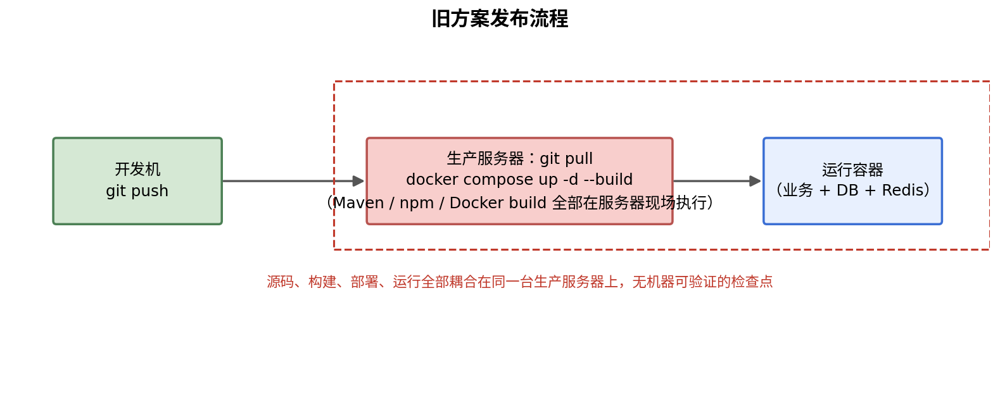
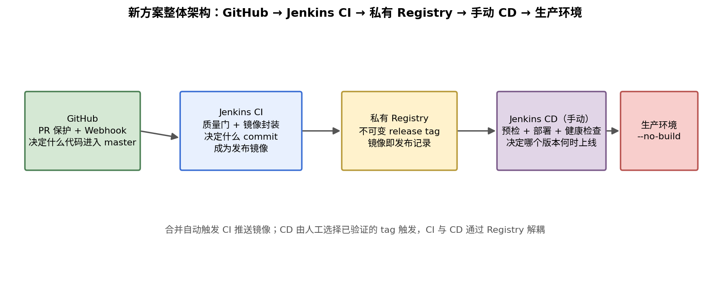
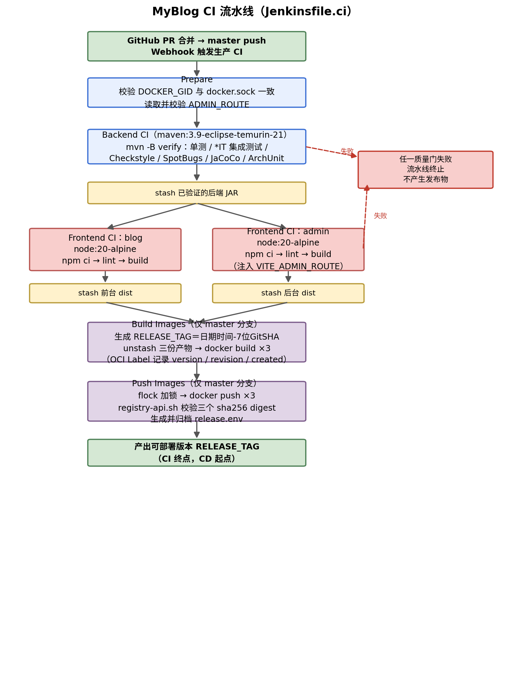
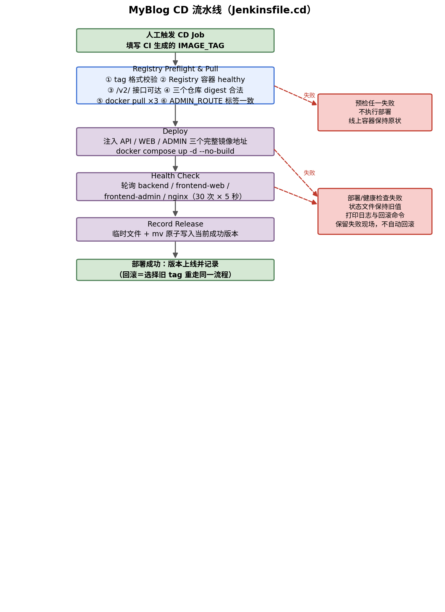
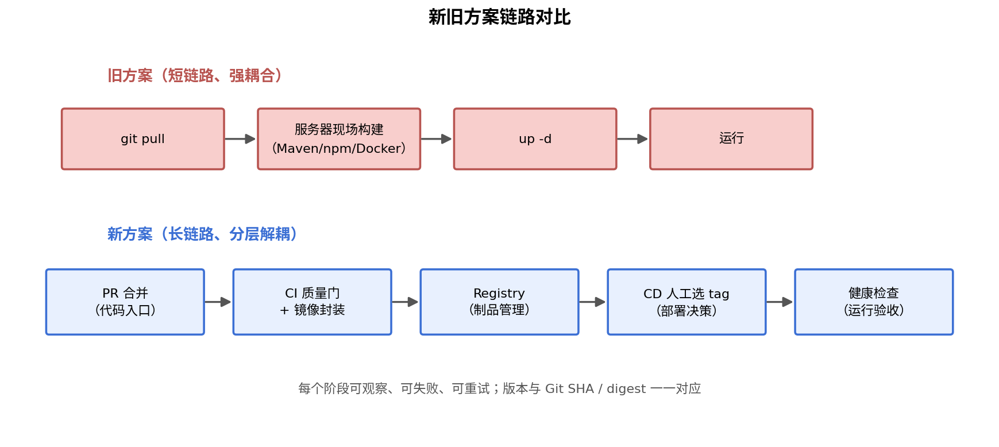

# MyLab 学习实验记录：从 git pull 到 CI/CD 流水线

> 这不是一篇部署手册，而是一次**学习实验**的记录。实验对象是我的个人博客 MyBlog；实验目标很明确：通过一次真实改造，掌握 Jenkinsfile 的语法和流水线搭建方法，配合代码仓库的 Webhook 和私有镜像仓库 Registry，完成 CI 与 CD 的解耦，把项目从「手工发布」带入「生产级部署」。
>
> 下文按「背景 → 疑问 → 设计 → 步骤 → 验收 → 结论」的实验脉络展开，重点讲清每一层为什么改、解决了什么问题、实验中踩过哪些坑。

## 一、实验背景与学习目标

### 1.1 实验对象

MyBlog 是一个前后端分离的个人博客系统，包含三个业务构建单元：

- Spring Boot 3.5 + Java 21 后端；
- React 18 + TypeScript 博客前台；
- React 18 + TypeScript 管理后台。

运行时还依赖 PostgreSQL、Redis 和 Nginx。项目早期规模不大时，我采用最直接的部署方式：服务器上保留一份 Git 工作区，更新时执行 `git pull`，再让 Docker Compose 从当前源码重新构建并启动所有服务：

```bash
cd /path/to/myblog
git pull origin master
docker compose up -d --build
docker compose ps
```

### 1.2 学习目标

- 理解并动手编写 Jenkinsfile（Declarative Pipeline）的阶段、agent、stash 等语法；
- 搭建完整的 CI/CD 流水线，并理解 CI（持续集成）与 CD（持续交付/部署）各自的职责；
- 学会用 GitHub 分支保护 + Webhook 控制代码入口和构建触发；
- 搭建私有镜像仓库 Registry，把镜像变成可追溯的发布记录；
- 建立可回滚、可验收的生产发布流程。

## 二、起点：旧部署方式回顾

旧方案的概念少、搭建快，一个 Compose 文件就编排了数据库、缓存、后端、前端和网关，在项目早期确实很省心。但当我想给项目加 HTTPS、让后台走独立路由、引入回滚能力时，逐渐发现「能部署」和「能可控地发布」是两回事。



*图 1　旧方案发布流程：源码、构建、部署全部耦合在生产服务器上*

这套流程的核心特征是：**源码、构建、部署和运行环境全部耦合在生产服务器上**。服务器既运行业务，又承担发布时的全部构建工作，整个链路没有任何机器可验证的检查点。

## 三、驱动实验的三个疑问

旧方案没有绝对的错误，但它留下了三个我想通过这次实验亲手回答的问题。

### 3.1 疑问一：流水线到底怎么搭？Jenkins 怎么用？

`docker compose up -d --build` 会在生产服务器上执行 Maven、npm 和 Docker build，服务器既要运行 PostgreSQL、Redis 和应用，又要在发布时承担 CPU、内存和磁盘压力。更重要的是，生产环境构建出的镜像依赖当时的工作区、缓存和基础镜像状态——即使 Git commit 相同，构建过程也未必有清晰的可追溯性。

需要说明的是：本实验中 Jenkins、Registry 和业务容器仍部署在同一台服务器，Jenkins 也通过宿主机 Docker Socket 构建镜像。所以新方案解决的是**职责、工作区和发布流程的隔离**，并没有消除单机资源竞争；未来可以把 Jenkins Agent 迁到独立构建机，而不改变 CI/CD 契约。

### 3.2 疑问二：测试检查能否自动化？

在 AI 的帮助下，项目其实已经具备不错的检查能力：后端有单元测试、Testcontainers 集成测试、Checkstyle、SpotBugs、JaCoCo 和 ArchUnit；两个前端有 ESLint、TypeScript 类型检查和 Vite 构建。但如果这些检查靠开发者手动执行，就必然会有遗漏。旧流程中，「拉取成功」与「可以发布」之间没有机器可验证的契约，于是我就想通过 Jenkins 在 CI 环节自动地执行这些测试。

### 3.3 疑问三：CI 和 CD 怎么解耦？

按照最初我对 CI（持续集成）与 CD（持续交付/部署）的理解，我可以通过 git push 就自动执行项目的构建与部署，但是这样直接将代码改动推到生产环境真的好吗？哪怕只有一些小改动也直接重新构建生产环境的项目这真的合适吗？基于这个疑问，我打算尝试将 CI 和 CD 进行解耦，问了 Kimi 后，它建议我设立镜像仓库来解耦，通过 CI 构建镜像，然后推送到镜像仓库，最后 CD 从镜像仓库拉取新构建的镜像，这样便能完成解耦，但这个具体应该怎么做呢？如果部署失败了怎么回滚呢？

## 四、实验设计：六条规则与两套 Compose

带着这三个疑问，我给这次改造设定了六条规则，作为整个实验的设计约束：

1. 生产 Compose 和 CD 阶段不再从源码构建业务镜像；
2. 只有通过质量门的产物才能进入镜像；
3. 前台、后台、后端必须共享同一个不可变 release tag；
4. CD 只部署指定 tag，不接收模糊的 `latest`；
5. 部署成功必须经过健康检查，并记录最后一次成功版本；
6. `master` 通过 GitHub PR 保护，构建、部署和镜像清理各自有独立流程。

同时，项目保留两套 Compose 文件，避免把本地开发的便利性和生产发布的纪律混在一起：

| 使用场景 | Compose 文件 | 镜像来源 | 网关 | 依赖 Jenkins/Registry |
|---|---|---|---|---|
| 本地一键部署 | `docker-compose.yml` | 当前源码构建 | HTTP | 否 |
| 生产 CI/CD | `deploy/docker-compose.yml` | CI 推送的不可变镜像 | HTTPS | 是 |

生产 Compose 完全没有 `build` 字段，三个业务镜像必须由 CD 通过环境变量 `API_IMAGE`、`WEB_IMAGE`、`ADMIN_IMAGE` 注入。这是一条重要的环境边界：

> **本地方案优化开发效率，生产方案优化可追溯性和可恢复性。**

## 五、新方案整体架构



*图 2　新方案整体架构：GitHub → Jenkins CI → 私有 Registry → 手动 CD → 生产环境*

新流程把一次发布拆成了三个可以单独理解的动作，这也是本实验对 CI/CD 解耦的核心体会：

- **GitHub 决定什么代码可以进入 master**（代码入口）；
- **CI 决定什么 commit 可以成为发布镜像**（质量门 + 制品生产）；
- **CD 决定哪个已经验证的版本在什么时候上线**（发布决策）。

## 六、步骤一：用 GitHub 管住代码入口

CI/CD 的起点不是 Jenkins，而是代码仓库。如果 `master` 可以被任意直接推送，后面的流水线再严格，也只能验证一个缺少审核过程的结果。

### 6.1 分支保护规则

在 GitHub Branch protection / Ruleset 中对 `master` 设置五条规则：

1. 所有变更必须通过 Pull Request 合并；
2. 禁止直接 push `master`；
3. 禁止 force push 和删除 `master`；
4. 根据协作人数设置审批数量；
5. 功能分支提交和 PR 更新不触发生产 CI，只有 PR 合并形成的 `master` push 才触发。

日常代码路径因此变成：

```text
feature/fix 分支 → commit → push → PR → review → merge → master
```

GitHub 只负责变更入口和审核记录，Jenkins 不需要向仓库写代码的权限——私有仓库配置只读 PAT 或 SSH 凭据即可，公开仓库甚至可以匿名拉取。生产密钥不写入 GitHub，而是保存在服务器的 `deploy/.env` 和 Jenkins 运行环境中。

### 6.2 Webhook 触发方式

Jenkins 通过生产 Nginx 的 HTTPS 路径对外暴露，Webhook 地址形如：

```text
https://<BLOG_DOMAIN><JENKINS_ROUTE>/github-webhook/
```

Webhook 只订阅 push 事件；生产 Multibranch Pipeline 用正则 `^master$` 过滤分支，不启用 PR discovery，也不启用 Poll SCM，从而避免功能分支 push、PR 创建和更新重复触发生产构建。

## 七、步骤二：Jenkins CI——先验证，再封装镜像

CI 的实现位于 `Jenkinsfile.ci`。顶层使用 `agent none`，每个阶段按需申请节点或容器，避免整条流水线长期占用同一种执行环境。下面是完整的 `Jenkinsfile.ci` 原文，后文逐阶段对照讲解：

```groovy
// ============================================================
// MyBlog CI：流水线支持分支校验；生产 Multibranch Job 只索引 PR 合并后的 master。
// Jenkins 节点需能访问 docker.sock，并通过 myblog-cicd 网络访问 registry:5000。
// ============================================================
pipeline {
    agent none

    options {
        timestamps()
        disableConcurrentBuilds()
        buildDiscarder(logRotator(numToKeepStr: '20'))
    }

    environment {
        REGISTRY_HOST = '127.0.0.1:5000'
        REGISTRY_API_HOST = 'registry:5000'
        REGISTRY_LOCK = '/var/jenkins_home/locks/myblog-registry.lock'
        DEPLOY_ENV_FILE = '/opt/myblog/deploy/.env'
    }

    stages {
        stage('Prepare') {
            agent any
            steps {
                script {
                    env.DOCKER_SOCKET_GID = sh(
                        returnStdout: true,
                        script: '''
                            set -eu
                            configured_gid=${DOCKER_GID:-}
                            socket_gid=$(stat -c '%g' /var/run/docker.sock)
                            printf '%s' "$configured_gid" | grep -Eq '^[0-9]+$' || {
                                echo 'DOCKER_GID 未配置或不是数字' >&2
                                exit 1
                            }
                            [ "$configured_gid" = "$socket_gid" ] || {
                                echo "DOCKER_GID=$configured_gid 与 docker.sock GID=$socket_gid 不一致" >&2
                                exit 1
                            }
                            printf '%s' "$socket_gid"
                        '''
                    ).trim()
                    env.ADMIN_ROUTE = sh(
                        returnStdout: true,
                        script: '''
                            set -eu
                            route=$(sed -n 's/^ADMIN_ROUTE=//p' "$DEPLOY_ENV_FILE" | tail -n 1 | tr -d '\r')
                            route=${route:-/admin}
                            printf '%s' "$route" | grep -Eq '^/[A-Za-z0-9._~-]+(/[A-Za-z0-9._~-]+)*$' || {
                                echo "ADMIN_ROUTE 格式错误: $route" >&2
                                exit 1
                            }
                            printf '%s' "$route"
                        '''
                    ).trim()
                }
            }
        }

        stage('Backend CI') {
            agent any
            steps {
                script {
                    // Declarative agent 无法安全读取运行期 GID，改在节点内启动 Maven 容器。
                    docker.image('maven:3.9-eclipse-temurin-21').inside(
                        "-v /var/run/docker.sock:/var/run/docker.sock " +
                        // 缓存必须挂到 /home/ubuntu/.m2：inside() 强制以 -u 1000:1000（镜像内
                        // ubuntu 用户，home=/home/ubuntu）运行，Maven 本地仓库在其 home 下，
                        // 挂 /root/.m2 永远不会被读到（PR #16 的误判，当时的问题只是镜像 id 变了）。
                        "-v /data/jenkins/.m2:/home/ubuntu/.m2 " +
                        "--group-add ${env.DOCKER_SOCKET_GID}"
                    ) {
                        dir('backend-java') {
                            // verify 包含 Checkstyle、单测、*IT 集成测试、SpotBugs 与 JaCoCo。
                            // 使用项目内的 maven-settings.xml（aliyun 镜像），本地仓库走宿主机缓存挂载。
                            // MAVEN_OPTS 限制 Maven 主 JVM 堆上限（CI 服务器内存有限）。
                            sh 'MAVEN_OPTS="-Xmx512m" mvn -B verify -s docker/maven-settings.xml'
                        }
                    }
                }
                stash name: 'backend-artifact',
                      includes: 'backend-java/target/myblog-backend-*.jar'
            }
            post {
                always {
                    junit allowEmptyResults: true,
                          testResults: 'backend-java/target/surefire-reports/*.xml, backend-java/target/failsafe-reports/*.xml'
                    recordCoverage enabledForFailure: true,
                                   tools: [[parser: 'JACOCO',
                                            pattern: 'backend-java/target/site/jacoco/jacoco.xml']]
                }
            }
        }

        stage('Frontend CI') {
            parallel {
                stage('blog (myblog/)') {
                    agent {
                        docker {
                            image 'node:20-alpine'
                            reuseNode true
                        }
                    }
                    steps {
                        dir('myblog') {
                            sh 'npm ci --no-audit --no-fund'
                            sh 'npm run lint'
                            sh 'npm run build'
                        }
                        stash name: 'web-artifact', includes: 'myblog/dist/**'
                    }
                }

                stage('admin (admin/)') {
                    agent {
                        docker {
                            image 'node:20-alpine'
                            reuseNode true
                        }
                    }
                    steps {
                        dir('admin') {
                            sh 'npm ci --no-audit --no-fund'
                            sh 'VITE_ADMIN_ROUTE="$ADMIN_ROUTE" npm run lint'
                            sh 'VITE_ADMIN_ROUTE="$ADMIN_ROUTE" npm run build'
                        }
                        stash name: 'admin-artifact', includes: 'admin/dist/**'
                    }
                }
            }
        }

        stage('Build Images') {
            when {
                branch 'master'
            }
            agent any
            steps {
                unstash 'backend-artifact'
                unstash 'web-artifact'
                unstash 'admin-artifact'
                script {
                    env.RELEASE_TAG = sh(
                        returnStdout: true,
                        script: 'printf "%s-%s" "$(TZ=Asia/Shanghai date +%Y%m%d-%H%M%S)" "$(git rev-parse --short=7 HEAD)"'
                    ).trim()
                    env.RELEASE_CREATED = sh(
                        returnStdout: true,
                        script: 'date -u +%Y-%m-%dT%H:%M:%SZ'
                    ).trim()
                    env.RELEASE_REVISION = sh(
                        returnStdout: true,
                        script: 'git rev-parse HEAD'
                    ).trim()
                }
                sh '''
                    set -eu
                    rm -rf .ci-image-context
                    mkdir -p .ci-image-context/backend .ci-image-context/web .ci-image-context/admin

                    backend_jar=$(find backend-java/target -maxdepth 1 -type f -name 'myblog-backend-*.jar' ! -name '*.original' | head -n 1)
                    test -n "$backend_jar"
                    cp "$backend_jar" .ci-image-context/backend/app.jar
                    cp -R myblog/dist .ci-image-context/web/dist
                    cp myblog/nginx.conf .ci-image-context/web/nginx.conf
                    cp -R admin/dist .ci-image-context/admin/dist
                    cp admin/nginx.conf .ci-image-context/admin/nginx.conf

                    docker build \
                      --build-arg OCI_VERSION="$RELEASE_TAG" \
                      --build-arg OCI_REVISION="$RELEASE_REVISION" \
                      --build-arg OCI_CREATED="$RELEASE_CREATED" \
                      -f deploy/images/backend.Dockerfile \
                      -t "$REGISTRY_HOST/myblog-api:$RELEASE_TAG" \
                      .ci-image-context/backend

                    docker build \
                      --build-arg OCI_VERSION="$RELEASE_TAG" \
                      --build-arg OCI_REVISION="$RELEASE_REVISION" \
                      --build-arg OCI_CREATED="$RELEASE_CREATED" \
                      -f deploy/images/web.Dockerfile \
                      -t "$REGISTRY_HOST/myblog-web:$RELEASE_TAG" \
                      .ci-image-context/web

                    docker build \
                      --build-arg OCI_VERSION="$RELEASE_TAG" \
                      --build-arg OCI_REVISION="$RELEASE_REVISION" \
                      --build-arg OCI_CREATED="$RELEASE_CREATED" \
                      --build-arg ADMIN_ROUTE="$ADMIN_ROUTE" \
                      -f deploy/images/admin.Dockerfile \
                      -t "$REGISTRY_HOST/myblog-admin:$RELEASE_TAG" \
                      .ci-image-context/admin
                '''
            }
            post {
                always {
                    sh 'rm -rf .ci-image-context || true'
                }
            }
        }

        stage('Push Images') {
            when {
                branch 'master'
            }
            agent any
            steps {
                sh '''
                    set -eu
                    mkdir -p "$(dirname "$REGISTRY_LOCK")"
                    (
                        flock -x 9
                        docker push "$REGISTRY_HOST/myblog-api:$RELEASE_TAG"
                        docker push "$REGISTRY_HOST/myblog-web:$RELEASE_TAG"
                        docker push "$REGISTRY_HOST/myblog-admin:$RELEASE_TAG"

                        sh scripts/registry-api.sh digest "$REGISTRY_API_HOST" myblog-api "$RELEASE_TAG"
                        sh scripts/registry-api.sh digest "$REGISTRY_API_HOST" myblog-web "$RELEASE_TAG"
                        sh scripts/registry-api.sh digest "$REGISTRY_API_HOST" myblog-admin "$RELEASE_TAG"
                    ) 9>"$REGISTRY_LOCK"

                    cat > release.env <<EOF
RELEASE_TAG=$RELEASE_TAG
RELEASE_REVISION=$RELEASE_REVISION
RELEASE_CREATED=$RELEASE_CREATED
EOF
                '''
                archiveArtifacts artifacts: 'release.env', fingerprint: true
            }
        }
    }

    post {
        success {
            script {
                if (env.BRANCH_NAME == 'master') {
                    echo "CI 通过，可部署镜像版本：${env.RELEASE_TAG}"
                } else {
                    echo 'CI 通过：当前分支不构建部署镜像。'
                }
            }
        }
        failure {
            echo 'CI 失败：未产生可部署版本。'
        }
    }
}
```

整条流水线的执行顺序如下图所示：



*图 3　CI 流水线流程图：Prepare → Backend CI → Frontend CI（并行）→ Build Images → Push Images*

### 7.1 流水线阶段总览

对照 `Jenkinsfile.ci` 的 `stages` 块，五个阶段的职责如下：

| 阶段 | 主要工作 | 失败后的结果 |
|---|---|---|
| Prepare | 校验 `DOCKER_GID` 与 docker.sock 的 GID 一致，从 `deploy/.env` 读取并校验 `ADMIN_ROUTE` | 不进入构建 |
| Backend CI | 在 Maven 容器中执行 `mvn -B verify`，归档 JUnit 与 JaCoCo 报告，stash 已验证 JAR | 不产生后端发布物 |
| Frontend CI | 前台、后台在两个 `node:20-alpine` 容器中**并行**执行安装、lint、类型检查和构建，各自 stash `dist` | 不产生前端发布物 |
| Build Images（`when: branch 'master'`） | 生成 `RELEASE_TAG`，unstash 三份产物并封装三个镜像 | 不推送镜像 |
| Push Images（`when: branch 'master'`） | `flock` 加锁推送、校验三个 digest、生成并归档 `release.env` | 不宣布可部署版本 |

注意 Build Images 和 Push Images 都带 `when { branch 'master' }` 条件：功能分支上的 CI 只做验证，不产出任何部署镜像——只有合并进 master 的代码才有资格变成发布物，这与第六节的 Webhook 分支过滤互相配合。另外 `options` 里的 `disableConcurrentBuilds()` 保证同一 Job 不会并发构建，避免两个构建同时争抢 Registry 推送。

### 7.2 Prepare：构建前的环境自检

Prepare 阶段做两件事。第一，校验环境变量 `DOCKER_GID` 与宿主机 `/var/run/docker.sock` 的实际 GID 是否一致——后续 Backend CI 的 Testcontainers 和镜像阶段的 `docker build` 都要通过挂载的 Docker Socket 操作宿主机 Docker，GID 不匹配会直接权限拒绝，把这个检查放在最前面可以让配置错误在构建开始前就暴露。第二，从生产 `deploy/.env` 读取 `ADMIN_ROUTE`（缺省 `/admin`）并用正则校验格式，这个值会在前端构建和 admin 镜像封装时注入，保证「构建时的后台路径」与「生产 Nginx 的后台路径」同源。

### 7.3 后端质量门：mvn verify 做了什么

后端在 `maven:3.9-eclipse-temurin-21` 容器中运行 `MAVEN_OPTS="-Xmx512m" mvn -B verify -s docker/maven-settings.xml`。这条命令不是简单编译，它串联了七项检查：

- JUnit 单元测试；
- Failsafe `*IT` 集成测试；
- Testcontainers 启动真实 PostgreSQL 和 Redis；
- Checkstyle 代码规范检查；
- SpotBugs 静态分析；
- JaCoCo 覆盖率报告；
- ArchUnit 分层依赖约束。

代码里有两个值得注意的细节：其一，`docker.image(...).inside()` 在节点内启动 Maven 容器并挂载 `/var/run/docker.sock` 和 `--group-add ${env.DOCKER_SOCKET_GID}`，这正是 7.2 校验 GID 的原因——Testcontainers 需要借宿主机 Docker 启动真实的数据库容器；其二，Maven 本地仓库缓存在注释中明确必须挂到 `/home/ubuntu/.m2`，因为 `inside()` 强制以 uid 1000 的 ubuntu 用户运行，挂 `/root/.m2` 永远不会被读到（注释里还记录了 PR #16 的误判教训）。`MAVEN_OPTS="-Xmx512m"` 则是因为 CI 服务器内存有限，限制 Maven 主 JVM 堆上限。

`post { always { ... } }` 会收集 Surefire/Failsafe 的 JUnit XML 报告并用 `recordCoverage` 发布 JaCoCo 覆盖率；后端产出的 JAR 用 `stash` 暂存，后续镜像阶段只拿这份「已经验证的 JAR」。

### 7.4 前端并行质量门

博客前台（`myblog/`）和管理后台（`admin/`）放在 `parallel` 块里，分别在两个 `node:20-alpine` 容器中并行运行：

```bash
npm ci --no-audit --no-fund
npm run lint
npm run build
```

项目的 `build` 脚本内部包含 TypeScript 类型检查，因此类型错误会直接让流水线失败。管理后台的两条 lint/build 命令前都注入了 `VITE_ADMIN_ROUTE="$ADMIN_ROUTE"`（取自 Prepare 阶段从生产配置读出的值），确保 Vite base 与生产 Nginx 的后台路径一致。两个 `dist` 同样通过 `stash` 交给镜像阶段。并行执行减少了串行等待，又保持前后台结果互不掩盖。

### 7.5 「构建一次，封装一次」

CI 不在业务 Dockerfile 里重新执行 Maven 或 npm，而是先完成全部验证，再在 Build Images 阶段把三份 stash 产物 `unstash` 出来，组装 `.ci-image-context/` 构建上下文（JAR 重命名为 `app.jar`，两个 `dist` 连同各自的 `nginx.conf` 拷入），用 `deploy/images/` 下的运行时 Dockerfile 封装结果：

- `myblog-api`：JRE 21 + 已验证 JAR；
- `myblog-web`：Nginx + 已验证前台 `dist`；
- `myblog-admin`：Nginx + 已验证后台 `dist`。

这样保证「通过测试的产物」和「放进镜像的产物」是同一份，而不是在镜像阶段重新编译出另一份结果。每次构建结束，`post { always }` 会清理临时的 `.ci-image-context/` 目录。

### 7.6 不可变 release tag：commit 如何变成「可部署版本」

三个镜像共用同一个 tag，格式为「日期时间-7 位 Git SHA」，由 Build Images 阶段生成：

```groovy
env.RELEASE_TAG = sh(returnStdout: true,
    script: 'printf "%s-%s" "$(TZ=Asia/Shanghai date +%Y%m%d-%H%M%S)" "$(git rev-parse --short=7 HEAD)"').trim()
```

```text
yyyyMMdd-HHmmss-7位GitSHA

127.0.0.1:5000/myblog-api:20260826-153000-a1b2c3d
127.0.0.1:5000/myblog-web:20260826-153000-a1b2c3d
127.0.0.1:5000/myblog-admin:20260826-153000-a1b2c3d
```

项目不创建 `latest`。三个 `docker build` 都通过 `--build-arg OCI_VERSION / OCI_REVISION / OCI_CREATED` 把 release tag、完整 Git SHA 和 UTC 构建时间写入 OCI Label，admin 镜像额外传入 `ADMIN_ROUTE`（最终落在 `com.myblog.admin-route` 标签上，供 CD 预检比对）。

Push Images 阶段用 `flock -x 9` 对 `myblog-registry.lock` 加排他锁后再推送三个镜像——这把锁与镜像清理任务共享，保证「推送、拉取、清理」三类操作不会并发踩踏 Registry。推送完成后，用 `scripts/registry-api.sh digest` 逐个读取三个仓库的 digest 校验。只有三个镜像全部推送成功、并且 Registry API 能读取到合法的 `sha256` digest 后，Jenkins 才归档 `release.env`：

```dotenv
RELEASE_TAG=20260826-153000-a1b2c3d
RELEASE_REVISION=<完整GitSHA>
RELEASE_CREATED=<UTC时间>
```

到这一步，一个 Git commit 才真正变成**可部署版本**——这是 CI 阶段的终点，也是 CD 阶段的起点。

## 八、步骤三：私有 Registry——把镜像当作发布记录

Registry 用独立的 `deploy/registry/docker-compose.yml` 管理，与博客应用生命周期解耦。关键约束：

- 使用官方 `registry:2` 镜像；
- 数据持久化到 `/data/registry`；
- 只绑定 `127.0.0.1:5000`，不向公网开放；
- Jenkins 通过外部网络 `myblog-cicd` 访问 `registry:5000`；
- 开启 manifest 删除，为后续垃圾回收做准备。

这是本机 HTTP Registry：宿主机 Docker 走回环地址访问，Jenkins 容器走隔离网络访问，均不暴露公网。若未来改为跨主机 Registry，必须增加 TLS、认证和独立备份，不能原样暴露当前 HTTP 端口。

**备注：镜像仓库的生命周期管理。** 镜像仓库不能只管推送、不管增长。项目用 `Jenkinsfile.registry-cleanup` 每天北京时间 03:30 调用 `scripts/registry-cleanup.sh`，保留规则是「最近 5 个合法 release tag + 当前成功部署 tag」（最多 6 个）：当前版本已在最近 5 个里就保留 5 个；线上仍运行较旧版本时额外保护它。

## 九、步骤四：Jenkins CD——部署的是版本，不是工作区

CD 的实现位于 `Jenkinsfile.cd`，被故意设计为手动参数化 Job：操作者必须填写 CI 生成的 `IMAGE_TAG`，由人来决定哪个已验证的版本、在什么时候上线。项目把「生成可发布版本」（CI 自动完成）和「让版本上线」（CD 人工触发）分开——对单机个人项目，这比每次合并都立即上线更稳妥，也保留了发布窗口和人工确认；回滚与普通部署走同一条路径。下面是完整的 `Jenkinsfile.cd` 原文：

```groovy
// ============================================================
// MyBlog CD：手动选择 CI 产生的不可变 tag，从本机 Registry 拉取并部署。
// CD 不执行镜像构建；Jenkins 需加入 myblog-cicd 网络并安装 curl、jq、flock。
// ============================================================
pipeline {
    agent any

    parameters {
        string(name: 'IMAGE_TAG',
               defaultValue: '',
               description: '必填，格式：yyyyMMdd-HHmmss-7位GitSHA')
    }

    options {
        timestamps()
        disableConcurrentBuilds()
        buildDiscarder(logRotator(numToKeepStr: '20'))
    }

    environment {
        REGISTRY_HOST = '127.0.0.1:5000'
        REGISTRY_API_HOST = 'registry:5000'
        REGISTRY_CONTAINER = 'myblog-registry'
        REGISTRY_LOCK = '/var/jenkins_home/locks/myblog-registry.lock'
        DEPLOY_STATE_FILE = '/var/jenkins_home/deploy-state/myblog-current-release'
        DEPLOY_COMPOSE_FILE = 'deploy/docker-compose.yml'
        DEPLOY_ENV_FILE = '/opt/myblog/deploy/.env'
        JENKINS_HOST_HOME = '/data/jenkins'
    }

    stages {
        stage('Registry Preflight & Pull') {
            steps {
                script {
                    env.TAG = params.IMAGE_TAG.trim()
                    env.API_IMAGE = "${env.REGISTRY_HOST}/myblog-api:${env.TAG}"
                    env.WEB_IMAGE = "${env.REGISTRY_HOST}/myblog-web:${env.TAG}"
                    env.ADMIN_IMAGE = "${env.REGISTRY_HOST}/myblog-admin:${env.TAG}"
                }
                sh '''
                    set -eu
                    printf '%s' "$TAG" | grep -Eq '^[0-9]{8}-[0-9]{6}-[0-9a-f]{7}$' || {
                        echo "IMAGE_TAG 格式错误: $TAG" >&2
                        exit 1
                    }

                    mkdir -p "$(dirname "$REGISTRY_LOCK")"
                    (
                        flock -x 9

                        registry_status=$(docker inspect --format '{{if .State.Health}}{{.State.Health.Status}}{{else}}none{{end}}' "$REGISTRY_CONTAINER" 2>/dev/null || echo missing)
                        if [ "$registry_status" != "healthy" ]; then
                            echo "Registry 容器未就绪: $registry_status" >&2
                            exit 1
                        fi
                        curl --fail --silent --show-error "http://$REGISTRY_API_HOST/v2/" >/dev/null

                        for repository in myblog-api myblog-web myblog-admin; do
                            digest=$(sh scripts/registry-api.sh digest "$REGISTRY_API_HOST" "$repository" "$TAG")
                            printf '%s' "$digest" | grep -Eq '^sha256:[0-9a-f]{64}$' || {
                                echo "Registry 镜像无效: $repository:$TAG" >&2
                                exit 1
                            }
                            echo "$repository:$TAG -> $digest"
                        done

                        docker pull "$API_IMAGE"
                        docker pull "$WEB_IMAGE"
                        docker pull "$ADMIN_IMAGE"
                    ) 9>"$REGISTRY_LOCK"

                    configured_admin_route=$(sed -n 's/^ADMIN_ROUTE=//p' "$DEPLOY_ENV_FILE" | tail -n 1 | tr -d '\r')
                    configured_admin_route=${configured_admin_route:-/admin}
                    image_admin_route=$(docker image inspect --format '{{index .Config.Labels "com.myblog.admin-route"}}' "$ADMIN_IMAGE")
                    if [ "$image_admin_route" != "$configured_admin_route" ]; then
                        echo "ADMIN_ROUTE 不一致：镜像=$image_admin_route，部署配置=$configured_admin_route" >&2
                        exit 1
                    fi
                '''
            }
        }

        stage('Deploy') {
            steps {
                sh '''
                    set -eu
                    case "$WORKSPACE" in
                        "$JENKINS_HOME"/*) ;;
                        *) echo "WORKSPACE 不在 JENKINS_HOME 下，无法换算宿主机路径" >&2; exit 1 ;;
                    esac
                    relative_workspace=${WORKSPACE#"$JENKINS_HOME"}
                    HOST_PROJECT_DIR="${JENKINS_HOST_HOME}${relative_workspace}" \
                    API_IMAGE="$API_IMAGE" \
                    WEB_IMAGE="$WEB_IMAGE" \
                    ADMIN_IMAGE="$ADMIN_IMAGE" \
                    docker compose --env-file "$DEPLOY_ENV_FILE" -f "$DEPLOY_COMPOSE_FILE" up -d --no-build
                '''
            }
        }

        stage('Health Check') {
            steps {
                sh '''
                    set -eu
                    for service in backend frontend-web frontend-admin nginx; do
                        ready=false
                        for attempt in $(seq 1 30); do
                            container_id=$(docker compose --env-file "$DEPLOY_ENV_FILE" -f "$DEPLOY_COMPOSE_FILE" ps -q "$service")
                            status=$(docker inspect --format '{{.State.Health.Status}}' "$container_id" 2>/dev/null || echo unknown)
                            if [ "$status" = "healthy" ]; then
                                echo "$service 已就绪"
                                ready=true
                                break
                            fi
                            echo "等待 $service 健康检查（当前: $status）... ($attempt/30)"
                            sleep 5
                        done
                        if [ "$ready" != "true" ]; then
                            echo "健康检查失败: $service" >&2
                            exit 1
                        fi
                    done
                    docker compose --env-file "$DEPLOY_ENV_FILE" -f "$DEPLOY_COMPOSE_FILE" ps
                '''
            }
        }

        stage('Record Release') {
            steps {
                sh '''
                    set -eu
                    state_directory=$(dirname "$DEPLOY_STATE_FILE")
                    mkdir -p "$state_directory"
                    temporary_state=$(mktemp "$state_directory/.myblog-current-release.XXXXXX")
                    printf '%s\n' "$TAG" > "$temporary_state"
                    mv "$temporary_state" "$DEPLOY_STATE_FILE"
                    echo "已记录当前成功部署版本: $TAG"
                '''
            }
        }
    }

    post {
        success {
            echo "部署成功：${env.TAG} 已上线并记录为当前版本。"
        }
        failure {
            echo "部署失败，成功版本状态文件未更新；请检查容器日志后手工选择 tag 回滚。"
            sh '''
                docker compose --env-file "$DEPLOY_ENV_FILE" -f "$DEPLOY_COMPOSE_FILE" ps || true
                docker compose --env-file "$DEPLOY_ENV_FILE" -f "$DEPLOY_COMPOSE_FILE" logs --tail=100 backend frontend-web frontend-admin nginx || true
                echo "回滚命令："
                echo "API_IMAGE=$REGISTRY_HOST/myblog-api:<TAG> WEB_IMAGE=$REGISTRY_HOST/myblog-web:<TAG> ADMIN_IMAGE=$REGISTRY_HOST/myblog-admin:<TAG> docker compose --env-file /opt/myblog/deploy/.env -f deploy/docker-compose.yml up -d --no-build"
            '''
        }
    }
}
```

整条流水线的执行顺序如下图所示：



*图 4　CD 流水线流程图：预检与拉取 → 部署 → 健康检查 → 记录版本*

### 9.1 阶段总览

| 阶段 | 主要工作 | 失败后的结果 |
|---|---|---|
| Registry Preflight & Pull | 六项预检（见 9.2），通过后拉取三个完整镜像 | 不执行部署，线上容器保持原状 |
| Deploy | 注入三个镜像地址，执行 `docker compose up -d --no-build` | 进入 `post failure` 诊断 |
| Health Check | 轮询四个服务的 Docker health status（30 次 × 5 秒） | 状态文件不更新，保留失败现场 |
| Record Release | 「临时文件 + 原子移动」写入当前成功版本 | —— |

### 9.2 六项部署前预检

对照 `Registry Preflight & Pull` 阶段的脚本，CD 在修改运行中容器之前，依次完成六项预检：

1. `IMAGE_TAG` 符合 release tag 格式（正则 `^[0-9]{8}-[0-9]{6}-[0-9a-f]{7}$`）；
2. Registry 容器状态为 `healthy`（`docker inspect` 读取健康状态）；
3. Jenkins 能访问 Registry 的 `/v2/` 接口（`curl --fail`）；
4. 三个仓库（myblog-api / myblog-web / myblog-admin）都存在这个 tag，且 digest 均为合法的 `sha256:` 值；
5. 三个完整镜像都能 `docker pull` 成功；
6. admin 镜像 Label 中的 `ADMIN_ROUTE` 与生产 `deploy/.env` 中的配置一致。

其中第 2~5 项在 `flock` 排他锁内执行——与 CI 的推送、Registry 清理任务共享同一把 `myblog-registry.lock`，避免部署拉到一半镜像被清理任务删掉。任一预检失败，CD 都不会执行 `docker compose up`，线上容器保持原状。

第六项 `ADMIN_ROUTE` 检查尤其重要：管理后台的 Vite base 在构建时就写进了静态文件，而 Nginx 路径来自部署配置，两者不一致时页面可能正常打开、但 JS/CSS 和前端路由全部 404——CI 在构建时把后台路径写入镜像 Label，CD 在部署前与生产配置比对，可以把这类「构建期路径」与「部署期路径」的漂移挡在部署之前。

### 9.3 Deploy：注入镜像、无构建部署

预检通过后，Deploy 阶段注入三个完整镜像地址并执行无构建部署：

```bash
HOST_PROJECT_DIR=... \
API_IMAGE="$API_IMAGE" WEB_IMAGE="$WEB_IMAGE" ADMIN_IMAGE="$ADMIN_IMAGE" \
docker compose --env-file "$DEPLOY_ENV_FILE" -f "$DEPLOY_COMPOSE_FILE" up -d --no-build
```

脚本开头先校验 `$WORKSPACE` 必须位于 `$JENKINS_HOME` 之下，再把容器内工作区路径换算成宿主机路径 `HOST_PROJECT_DIR`——因为 Jenkins 容器是通过挂载的 Docker Socket 让**宿主机** Docker 执行 compose，宿主机看到的是自己的文件系统。`--no-build` 参数与生产 Compose 中不存在 `build` 字段构成双重约束：服务器部署阶段只做镜像拉取和容器编排，不再受源码工作区和构建缓存影响。

### 9.4 Health Check 与 Record Release：先证明健康，再记账

部署后，CD 轮询 backend、frontend-web、frontend-admin、nginx 四个服务的 Docker health status，每个服务最多等待 30 次 × 5 秒；全部健康后，Record Release 阶段才用「`mktemp` 临时文件 + `mv` 原子移动」的方式更新当前成功版本记录 `/var/jenkins_home/deploy-state/myblog-current-release`。原子写入保证清理任务读到的永远是完整的旧值或新值，不会读到写了一半的文件。

如果部署或健康检查失败，状态文件保持旧值；`post { failure }` 会打印 `docker compose ps`、四个服务最近 100 行日志和一条手工回滚命令，但不自动回滚——自动回滚可能覆盖最有价值的失败现场，且健康检查失败不意味着旧容器可以无条件恢复。

回滚因此不需要切 Git 分支，也不需要重新构建：只要在 CD Job 中填写仍被保留的旧 tag，就会重新执行同样的预检、拉取、部署和健康检查。

> **发布和回滚终于成为同一种操作：选择一个已经验证过的版本并部署。**

## 十、如何验收这套流水线

实验的验收分为四组，每组都是可以实际操作的检查项。

### 10.1 代码入口

- 功能分支 push 不触发生产 CI；
- PR 创建和更新不触发生产 CI；
- `master` 不能直接 push 或 force push；
- PR 合并后的 `master` push 只触发一次 CI。

### 10.2 CI

- 后端单测、集成测试或静态检查失败时不构建发布镜像；
- 任一前端 lint、类型检查或构建失败时不构建发布镜像；
- 三个仓库生成相同 release tag，且都能读取合法 digest。

### 10.3 CD

- 空 tag、非法 tag 和不存在的 tag 在部署前失败；
- Registry 故障时不修改运行中容器；`ADMIN_ROUTE` 不匹配时不部署；
- CD 日志中不出现 `docker build`；
- 四个服务全部健康后才更新当前版本状态文件；部署失败时状态文件保持旧值。

### 10.4 回滚与清理

- 选择旧 tag 可以走同一 CD 流程恢复；
- 当前线上 tag 即使不在最近 5 个中也不会被清理；
- 三个运行容器版本不一致时清理任务直接退出；
- Dry Run 只输出计划不删除；Cleanup 持锁时，CI 推送和 CD 拉取会等待。

## 十一、新旧方案对比与实验结论

| 维度 | 旧方案：git pull + 现场构建 | 新方案：GitHub + Jenkins + Registry |
|---|---|---|
| 代码入口 | 可直接更新 master | 功能分支 + PR + master 保护 |
| 触发方式 | SSH 后手工执行命令 | 合并触发 CI，人工选 tag 执行 CD |
| 质量检查 | 依赖人工记忆或夹在镜像构建中 | 前后端都有显式质量门 |
| 发布物 | 本地镜像或浮动 latest | 三个同版本不可变镜像 |
| 版本关联 | 代码、镜像、容器关系模糊 | tag、Git SHA、OCI Label、digest 可追溯 |
| 生产部署 | 拉源码重新构建 | 只拉指定镜像，--no-build 部署 |
| 失败判断 | 人工查看日志和页面 | 预检 + Docker 健康检查 |
| 回滚 | 切代码重建，结果可能变化 | 选择保留的旧 tag 重新部署 |
| 镜像空间 | 手工 prune | 定时保留最近版本并保护线上版本 |
| 并发控制 | 无 | 推送、拉取、清理共享 Registry 锁 |
| 对外暴露 | 易临时开放多个管理端口 | Nginx HTTPS 唯一入口 |
| 主要代价 | 发布风险随复杂度增长 | 初始搭建复杂，需维护 Jenkins/Registry |



*图 5　新旧方案链路对比：短链路耦合 vs 长链路分层*

旧方案是一条短链路，但每一步都依赖服务器当前状态和操作者经验；新方案链路更长，却把代码审核、质量验证、制品管理、部署决策和运行验收拆成了可观察、可失败、可重试的阶段。

### 11.1 这次实验真正学到的东西

最初我把 CI/CD 理解成「代码 push 后自动执行几条命令」。做完这次改造后，更准确的理解是：

> **CI/CD 的核心不是自动化命令数量，而是建立从代码到运行版本的可信链路。**

这条链路需要回答四个问题：

1. 这段代码是否经过了受控入口？
2. 这个制品是否通过了约定的质量检查？
3. 线上运行的是否就是被验证过的那份制品？
4. 失败时能否识别并恢复到一个明确版本？

### 11.2 后续演进方向

- 增加合并前 PR CI，并把状态检查设为 GitHub 必需条件；
- 为跨主机 Registry 增加 TLS、认证、备份和容量监控；
- 增加 Jenkins 配置即代码（JCasC）和凭据备份；
- 把健康检查扩展为真实业务 smoke test；
- 停机窗口不可接受时，引入滚动、蓝绿或双机部署；
- 增加发布通知、耗时趋势和失败原因统计。

这次改造没有追求一次性搭建「最复杂」的平台，而是从项目真实痛点出发，把手工发布逐步替换成一条可以解释、验证和回滚的工程链路。对个人项目来说，这种演进比单纯堆叠工具更有学习价值。

### 11.3 参考实现

- CI 流水线：`Jenkinsfile.ci`
- CD 流水线：`Jenkinsfile.cd`
- Registry 清理流水线：`Jenkinsfile.registry-cleanup`
- 生产镜像编排：`deploy/docker-compose.yml`
- Jenkins 编排：`deploy/jenkins/docker-compose.yml`
- Registry 编排：`deploy/registry/docker-compose.yml`
- Registry 清理脚本：`scripts/registry-cleanup.sh`
- CI/CD 设计约束：`docs/CI-CD.md`；生产部署指南：`deploy/README.md`
