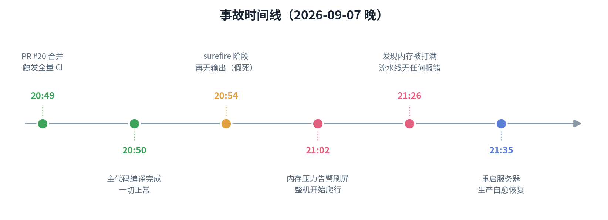
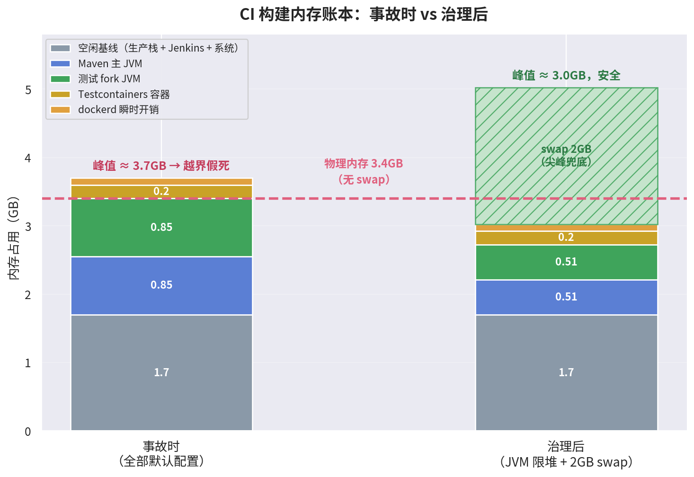
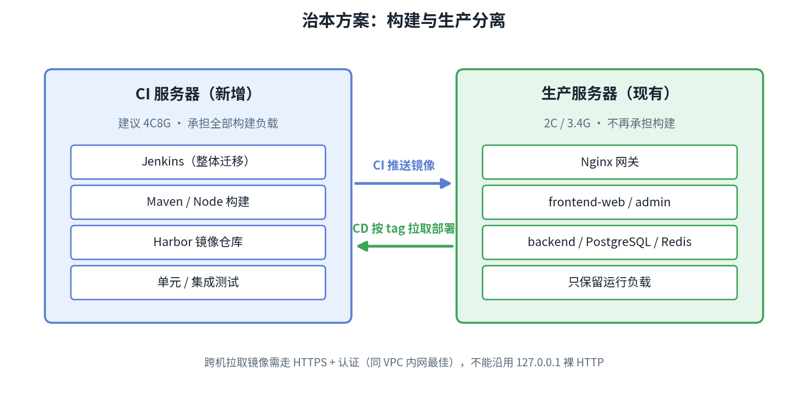

# CI 构建内存耗尽事故复盘：当流水线"假死"而不是崩溃

> 本文复盘 MyBlog 项目在 2026 年 9 月 7 日发生的一次 CI 事故：一次常规的 PR 合并触发全量流水线后，构建既不报错也不推进，整机"假死"约 46 分钟。没有 OOM 日志、没有任何错误输出，只有一台 2 vCPU / 3.4GB 内存、无 swap 的服务器在无声地挣扎。本文完整还原事故经过、根因分析与修复方案，并总结出小内存机器上运行 CI 的四条经验。

## 一、事故概述

| 项 | 内容 |
|---|---|
| 发生时间 | 2026-09-07 20:49 ～ 21:35（约 46 分钟） |
| 影响范围 | CI 流水线卡死；生产站点未宕机，但整机响应严重变慢 |
| 触发条件 | PR #20（前端 Vue→React 重写）合并到 master，触发全量 CI |
| 根因 | 2 vCPU / 3.4GB / 无 swap 的单机上，CI 构建与生产栈内存峰值叠加越界 |
| 恢复方式 | 重启服务器；随后实施 swap + JVM 限堆的永久性修复（PR #21） |

## 二、事故经过：一条"卡住"而非"失败"的流水线

20:49，PR #20 合并进 master，Jenkins 全量 CI 启动。起初一切正常：

- 20:50，后端 160 个源文件的主代码编译完成，仅耗时 18 秒；
- 20:51，测试代码编译完成，但 25 个文件花了 53 秒——事后回看，这是资源紧张的第一迹象；
- 20:54，构建进入 surefire 单元测试阶段，打印完 JUnit provider 信息后**再无任何输出**。

正常情况下这一步只需几秒，但日志就此定格：不报错、不退出、不推进。从 21:02 起，系统 journal 被同一行日志持续刷屏：

```
systemd-journald: Under memory pressure, flushing caches
```

21:26，登录服务器确认内存已被打满；21:35，重启服务器，全部容器依靠 `restart: unless-stopped` 策略自愈，生产站点恢复，流水线随重启中断。



值得注意的是，事故并非毫无预兆：8 月 25、26 日的 dockerd 日志中已出现过 `failed to read oom_kill event` 告警——内存吃紧并非首次，只是此前未造成可见故障。

## 三、关键误导：为什么没有任何错误日志

排查这类事故，第一反应通常是查 OOM Killer 日志——内存不够，内核总该杀掉一些进程。然而翻遍上一次开机的 4947 行内核日志，**OOM 记录为 0 条**。这正是本次事故最具误导性的一点。

> 💡 **名词解释：OOM Killer**
> OOM（Out of Memory）Killer 是 Linux 内核的最后一道防线：当内存彻底耗尽时，内核挑选一个进程杀掉以释放内存，并在日志中留下记录。多数内存事故都能在日志中找到它的痕迹。

> 💡 **名词解释：swap（交换分区）**
> swap 是磁盘上预留的一块空间。物理内存不足时，内核可将暂时不活跃的内存页换出到磁盘，腾出内存救急。它很慢，但能在内存尖峰时兜底。**事故服务器未配置 swap。**

没有 swap 意味着：内存耗尽时，内核既无处换出内存页，又（在当时的压力形态下）未触发 OOM Killer，唯一能做的是**反复回收页缓存**——把内存中缓存的文件数据丢弃、再读、再丢，循环往复。journal 中刷屏的 `Under memory pressure` 正是这种挣扎的表现。

> 💡 **名词解释：页缓存（page cache）**
> Linux 会将空闲内存用于缓存从磁盘读过的文件，再次读取时无需访问磁盘。内存紧张时这些缓存可以被回收，但回收有成本：内核需要持续扫描、判断、释放。当内存压力长期存在，CPU 大量消耗在"回收—仍然不够—再回收"的循环中，整机进入"爬行"状态。

其结果就是：所有进程一起变慢，但无一死亡。外部表现就是流水线"卡住"而非"失败"——**无 swap 的机器上，内存耗尽往往表现为假死，而不是干脆的 OOM kill**。

## 四、根因分析：一本算错的内存账

服务器配置为 **2 vCPU / 3.4GB 内存**，且存在一个结构性问题：**CI 构建与生产环境同机部署**，没有任何隔离。

### 4.1 内存账本

CI 空闲基线（实测 `docker stats`）：

| 组件 | 常驻内存 |
|---|---|
| Jenkins JVM | ~630 MB |
| 生产后端 JVM | ~619 MB |
| postgres / redis / registry | ~120 MB |
| nginx + 两个前端静态容器 | ~20 MB |
| dockerd + containerd | ~165 MB |
| 云监控 agent + 系统 | ~200 MB |
| **合计** | **~1.7 GB** |

3.4GB 的物理内存，空闲时仅剩约 1.7GB 余量。日常平稳运行，只是因为此时没有构建负载。

`mvn verify` 启动后的峰值新增：

| 新增进程 | 峰值上限 | 说明 |
|---|---|---|
| Maven 主 JVM | ~850 MB | 默认堆上限 = 物理内存的 1/4 |
| surefire/failsafe fork 的测试 JVM | ~850 MB | 独立 JVM，默认同样取 1/4 |
| Testcontainers（PG + Redis） | ~200 MB | 集成测试临时容器 |
| dockerd 起容器瞬时开销 | ~100 MB | — |

1.7GB 基线 + 约 2GB 新增 ≈ **3.6GB+ > 3.4GB 物理内存**，且无 swap 兜底，账就此爆掉。流水线恰好冻结在 surefire 单测阶段（failsafe 集成测试尚未开始），说明越界点发生在**双 JVM 叠加**，与测试容器无关。



### 4.2 为什么 JVM 会"超额申请"

> 💡 **名词解释：JVM 堆与 -Xmx**
> JVM 运行 Java 程序时会向操作系统申请一块"堆内存"存放对象，其最大值由 `-Xmx` 控制。**不显式设置时，JVM 默认按物理内存的 1/4 取值。** 在 3.4GB 的机器上，每个 JVM 都认为自己可以使用约 850MB——Maven 主进程一个、测试 fork 进程一个，仅这两者即达 1.7GB。
>
> 一个常见误区是"运行在 Docker 容器中，JVM 应该只能看到容器的限制"。实际上，容器未设置 memory limit 时，JVM 看到的仍是**宿主机的全部物理内存**，默认堆上限依旧按 3.4GB 计算。

> 💡 **名词解释：surefire / failsafe**
> Maven 的两个测试插件：surefire 执行单元测试，failsafe 执行集成测试。默认配置下它们会 **fork 出新的 JVM 进程**运行测试——因此一次 `mvn verify` 至少有两个 Java 进程同时占用内存。

### 4.3 从"超一点内存"到"假死"：GC 死亡螺旋

两个 JVM 陷入的不是简单的内存超限，而是 **GC 死亡螺旋**：

> 💡 **名词解释：Full GC 死亡螺旋**
> GC（垃圾回收）是 JVM 自动回收不再使用的对象的机制。堆内存接近上限时，JVM 频繁触发 Full GC（全量回收）试图腾出空间。Full GC 耗 CPU 且暂停业务线程；若内存确实不足，就会形成恶性循环：堆将满 → Full GC → 回收不出多少空间 → 很快又满 → 再次 Full GC……仅有的 2 个 vCPU 全部耗在 GC 上，业务代码几乎不推进。进程活着，但什么也做不了。

### 4.4 结构性原因小结

1. **CI 与生产同机**：构建负载与生产负载共用 3.4GB，没有隔离；
2. **JVM 全部不设防**：Jenkins、Maven、测试 fork 均按物理内存比例取默认堆；
3. **无 swap**：分钟级的构建内存尖峰没有任何缓冲层，越界即整机爬行。

## 五、修复方案：swap 兜底 + JVM 全面限堆

修复于事故当晚实施（PR #21），分两部分。

### 5.1 宿主机：新增 swap

- 新建 2GB swapfile，写入 `/etc/fstab` 持久化；
- 设置 `vm.swappiness=10`；
- 清理卡死流水线残留的 5 个 maven 容器。

> 💡 **名词解释：swappiness**
> 取值 0~100 的内核参数，表示内核使用 swap 的积极程度。设为 10 的含义是：**尽量不用 swap，仅在万不得已时兜底**——swap 是磁盘，速度慢。它是保险，而不是日常资源。

### 5.2 JVM 限堆（三处）

| 位置 | 改动 |
|---|---|
| `deploy/jenkins/docker-compose.yml` | `JAVA_OPTS=-Xmx768m -XX:MaxMetaspaceSize=256m`，限制 Jenkins 自身 |
| `Jenkinsfile.ci` | 新增 `MAVEN_OPTS="-Xmx512m"`，限制 Maven 主 JVM |
| `backend-java/pom.xml` | surefire/failsafe 的 `argLine` 改为 `@{argLine} -Xmx512m`，限制测试 fork JVM |

第三处改动中有一个容易忽略的细节：

> 💡 **名词解释：`@{argLine}` 占位符**
> 项目使用 JaCoCo 做代码覆盖率统计，JaCoCo 需要在测试 JVM 启动参数中注入 agent，注入目标正是 `argLine`。如果直接将 `argLine` 写死为 `-Xmx512m`，会**覆盖掉 JaCoCo 的注入**，覆盖率统计随之静默失效。`@{argLine}` 的语义是"保留其他方追加的内容"，即"在原有参数基础上再附加 -Xmx512m"。修改 JVM 参数时意外踩掉覆盖率统计，是一种很隐蔽的二次事故。

治理后的内存预算：峰值从 ~5GB+ 压到 ~3.5GB 以内，另有 2GB swap 兜底。验证结果：本地 `mvn test` 271 个单元测试全部通过，BUILD SUCCESS，耗时 50 秒；PR #21 合并后的首次全量 CI 即为生产环境实测。

## 六、治本规划：CI 与生产分离

限堆 + swap 只是让现状可运行，**构建与生产同机的结构性风险仍然存在**——构建高峰期依然会拖累生产响应。规划中的彻底解法是引入独立的 CI 服务器：



方案要点：

- **规格**：CI 服务器建议至少 4C8G。若部署 Harbor 镜像仓库，其自身（portal/core/registry/postgres/redis/jobservice）空转约需 1.5–2GB，2C4G 只会让"Jenkins + Harbor + 构建"在新机器上重蹈覆辙；若仅迁移现有的轻量 `registry:2`（约 25MB），2C4G 亦可接受。
- **Harbor vs registry:2**：Harbor 提供 Web UI、RBAC、漏洞扫描与图形化保留策略，适合作为学习与演进方向；现有 registry:2 + 清理脚本已满足"保留最近 5 个 tag + 保护当前部署 tag"的需求，单纯解决问题不必强上 Harbor。
- **网络**：生产 CD 需从 CI 侧拉取镜像——同 VPC 走内网最佳；走公网必须配置 HTTPS + 认证，不能沿用当前 `127.0.0.1:5000` 的裸 HTTP。
- **迁移清单**：Jenkins 数据目录整体搬迁 → CI 脚本中的 registry 地址与节点假设 → CD 改为远程拉取 → 生产 Compose 镜像名前缀 → Registry 清理逻辑迁移 → 生产 registry 容器退役。

## 七、经验教训

**1. 无 swap 的机器上，内存耗尽表现为"假死"而非 OOM kill。**
排查内存问题不能只查 OOM 日志。本次事故 4947 行内核日志中 OOM 记录为 0，真正的关键信号是 journal 中持续刷屏的 `Under memory pressure`。

**2. 容器内 JVM 默认堆按宿主机物理内存计算。**
小内存机器上必须显式设置 `-Xmx`，否则每个 JVM 都以为自己可以使用 1/4 内存，多个 JVM 叠加即爆炸。

**3. CI 峰值要按"基线 + 全部并发进程上限"算账。**
空闲时的 `free` 显示的余量不代表构建时的余量——构建一旦启动，Maven、测试 fork、Testcontainers 会同时申请内存。

**4. 监控告警出现时就该处理，不要等到故障发生。**
事发前两周，dockerd 已出现过 `failed to read oom_kill event` 告警。告警是事故的彩排。

## 结语

本次事故的直接损失有限（生产未宕机，46 分钟恢复），但暴露的问题具有普遍性：**在资源受限的环境中，默认值是不可信的**。JVM 的默认堆、Docker 的默认无限制、云服务器的默认无 swap——每个默认值单独看都"合理"，叠加在一起就是一颗定时炸弹。

对于同样在小内存机器上运行 CI 的实践者，结论只有一句话：**swap 配上，-Xmx 设上，告警别晾着。**

---

*相关文档：[事故复盘原始记录](../docs/事故复盘-CI构建内存耗尽.md)（含完整时间线与命令细节）*
