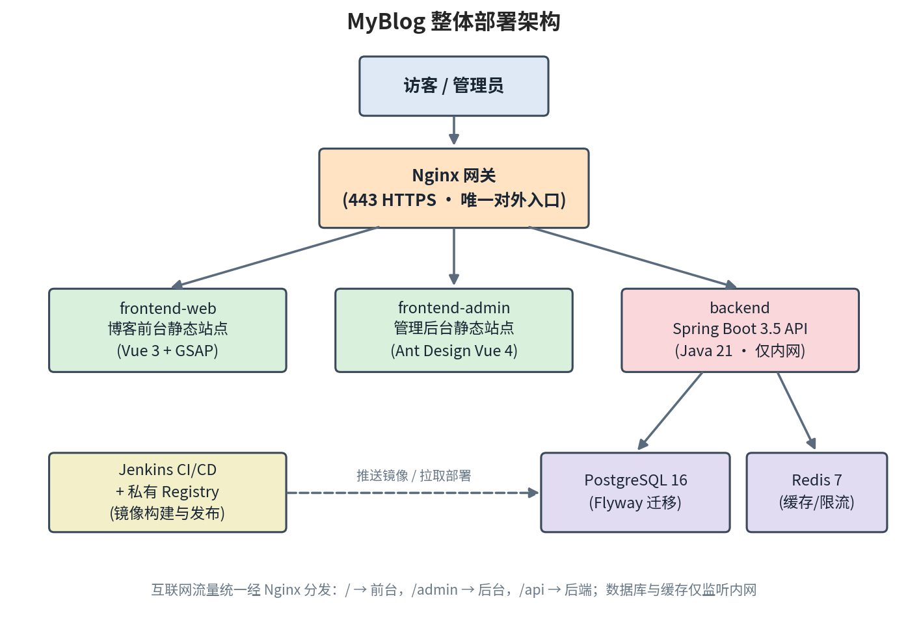
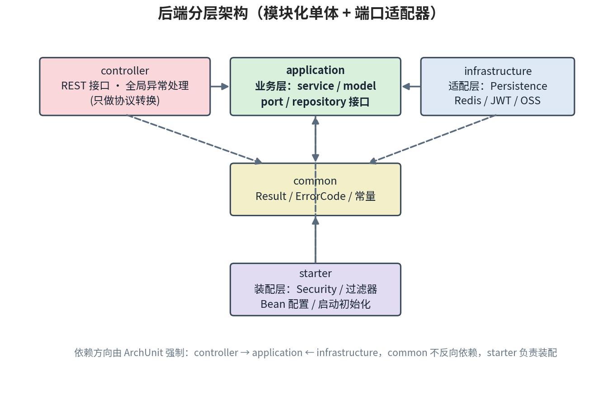

# MyBlog：一个前后端分离、Docker 化部署的个人博客系统

> 从访客前台到管理后台，从本地一键部署到 Jenkins 生产 CI/CD —— 这篇文章带你快速了解 MyBlog 项目的整体设计与主要功能。

## 一、项目概述

MyBlog 是一个完整的个人博客系统，由三部分组成：

- **博客前台**：面向访客的展示站点，承载首页、关于、技能、足迹、爱好、随笔、实验室七个内容模块；
- **管理后台**：面向管理员的内容管理系统，支持草稿编辑、发布、下线、历史版本恢复，以及数据仪表盘；
- **后端 API**：Spring Boot 模块化单体应用，提供统一的 REST 接口。

整个系统采用**前后端分离**架构，全部组件 **Docker 容器化**，本地可以一键部署，生产环境则通过 **Jenkins + 私有 Registry** 实现完整的 CI/CD 流水线。

## 二、技术栈一览

| 模块 | 技术选型 |
|------|----------|
| 博客前台 | Vue 3 + TypeScript + Vite + GSAP + Tailwind CSS 4 |
| 管理后台 | Vue 3 + TypeScript + Vite + Ant Design Vue 4 + ECharts 5 |
| 后端 | Spring Boot 3.5 + Java 21 + MyBatis-Plus |
| 数据与缓存 | PostgreSQL 16 + Redis 7 + Flyway |
| 部署运维 | Docker Compose + Nginx + Jenkins |

前台用 GSAP 做动效、Tailwind 做样式；后台基于 Ant Design Vue 组件库，避免重复造轮子；后端则以"质量门"著称——`mvn verify` 一次跑完单元测试、Checkstyle、SpotBugs、JaCoCo 覆盖率与 ArchUnit 架构约束。

## 三、整体架构



所有流量统一经过 **Nginx 网关**（生产环境 443 HTTPS，唯一对外入口）：

- `/` → 博客前台静态站点（`frontend-web` 容器）
- `/admin/` → 管理后台静态站点（`frontend-admin` 容器，路径前缀可配置）
- `/api/` → Spring Boot 后端（仅监听内网，不直接暴露）

后端向下连接 **PostgreSQL 16**（Flyway 管理表结构迁移）和 **Redis 7**（缓存、限流、互动计数）。前端两个静态站点和后端都不暴露主机端口，只能在内网被 Nginx 访问，攻击面最小化。

项目提供两套编排：

- **本地一键部署**：根目录 `docker-compose.yml`，从源码构建，仅 HTTP，适合开发调试；
- **生产部署**：`deploy/docker-compose.yml`，纯镜像部署（image-only），由 CI 构建镜像推送到私有 Registry，CD 按不可变 tag 拉取发布。

## 四、后端分层设计

后端是这个项目最有"工程味"的部分——**模块化单体 + 端口适配器（Ports & Adapters）**风格，分层依赖方向由 ArchUnit 测试强制约束：



- **controller**：只做 HTTP 协议转换，禁止业务逻辑，禁止直接碰 Mapper/Redis/OSS；
- **application**：业务核心，只依赖 `repository`/`port` 接口，不感知基础设施实现；业务模块按域划分：`auth`（认证）、`user`（用户管理）、`content`（内容）、`file`（文件）、`engagement`（互动计数）、`system`（系统信息）；
- **infrastructure**：适配层，实现持久化、Redis、JWT、OSS 等接口；
- **common**：`Result` 统一响应、`ErrorCode` 错误码枚举等公共契约，不反向依赖任何层；
- **starter**：装配层，负责 Security、过滤器、Bean 配置与启动初始化。

其他值得一提的约定：统一 `Result<T>` 响应（`code=0` 成功，HTTP 状态码取自错误码）、业务异常由全局异常处理器统一转换、JSON 字段 snake_case、敏感配置全部走环境变量、关键操作必记审计日志。

## 五、主要功能

### 1. 版本化内容系统（核心亮点）

七个内容模块（home / about / skills / footprints / hobbies / vibe / mylab）共享同一套版本化机制：

- 每个模块同一时刻**至多一个草稿 + 一个线上版本**；
- **发布即生成不可变历史版本**，历史版本可随时恢复到草稿继续编辑；
- 线上版本只读，须先下线才能删除；
- 草稿保存使用**乐观锁**（`expected_updated_at`）防止并发覆盖，写操作对模块加行锁串行化；
- MyLab 模块支持 Markdown 正文，公开列表不返回正文，单篇详情按需获取。

### 2. 认证与安全

- JWT **双令牌**（access + refresh），退出登录把 jti 写入 Redis 黑名单吊销；
- 密码 BCrypt 加密（强度 12），初始管理员仅在系统无用户时创建一次；
- 登录接口独立更严的限流阈值 + 全局限流，均基于 Redis，故障时 fail-open；
- 访客标识经 HMAC 哈希，互动明细只存 Redis（72h TTL）不落库，保护访客隐私。

### 3. 互动计数

浏览量、点赞数通过 **Redis Lua 脚本原子操作**实现，定时快照落库到 PostgreSQL；Redis 故障时自动降级读快照，保证页面数据始终可用。

### 4. 文件管理

文件元数据入库，实体文件上传 OSS，支持预签名 URL；管理后台可在线管理文件的上传与删除。

### 5. CI/CD 流水线

```text
GitHub PR 合并到 master
  → CI 质量门与集成测试
  → 构建三个镜像（api / web / admin）
  → 推送本机私有 Registry
  → CD 校验并拉取指定 tag
  → 无构建部署，支持按保留 tag 回滚
```

三个 Jenkinsfile 各司其职：`ci` 负责质量门与镜像推送，`cd` 负责指定 tag 部署，`registry-cleanup` 每天定时清理旧镜像（每仓库保留最近 5 个 tag 并保护当前部署版本）。

## 六、目录结构速览

```text
MyBlog/
├── myblog/                  # 博客前台（Vue SPA）
├── admin/                   # 管理后台前端（Vue SPA）
├── backend-java/            # Spring Boot 后端
│   └── src/main/java/com/myblog/
│       ├── controller/      # REST 接口 + 全局异常处理
│       ├── application/     # 业务层（service / model / port）
│       ├── infrastructure/  # 适配层（Persistence / Redis / JWT / OSS）
│       ├── starter/         # 装配层（Security / 配置 / 初始化）
│       └── common/          # Result / ErrorCode / 常量
├── nginx/                   # 本地 HTTP 网关配置
├── deploy/                  # 生产 Compose、HTTPS Nginx、Registry、Jenkins
├── docs/                    # API 文档、数据库设计、CI/CD 设计
├── docker-compose.yml       # 本地一键部署
└── Jenkinsfile.*            # CI / CD / Registry 清理
```

## 七、总结

MyBlog 虽然是一个个人博客，但工程实践上毫不含糊：**清晰的分层架构并用 ArchUnit 强制约束、版本化的内容管理、完善的认证限流体系、从质量门到镜像仓库的全自动 CI/CD**。它既是一个能跑起来的博客，也是一份可参考的全栈项目工程化范本。

---

*本文配图由项目架构信息生成，完整细节可查阅项目内 README、后端架构文档与 API 接口文档。*
