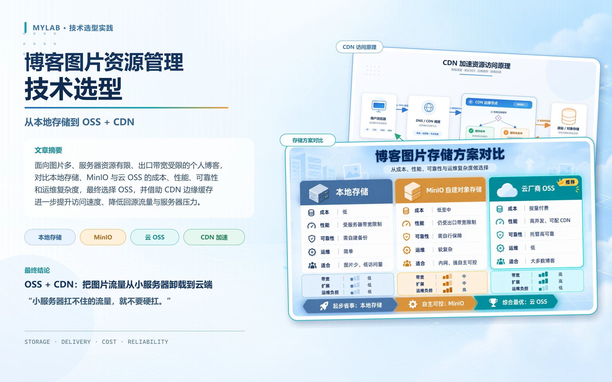
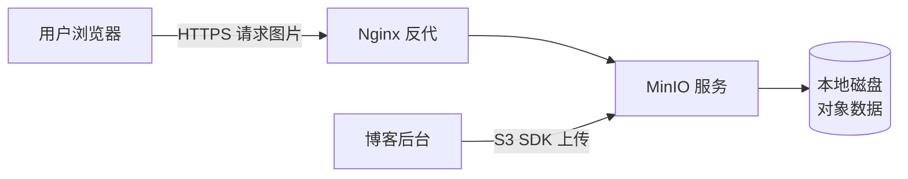
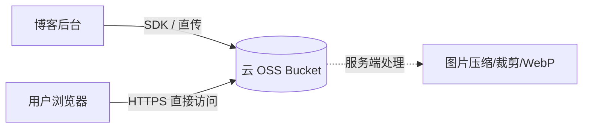
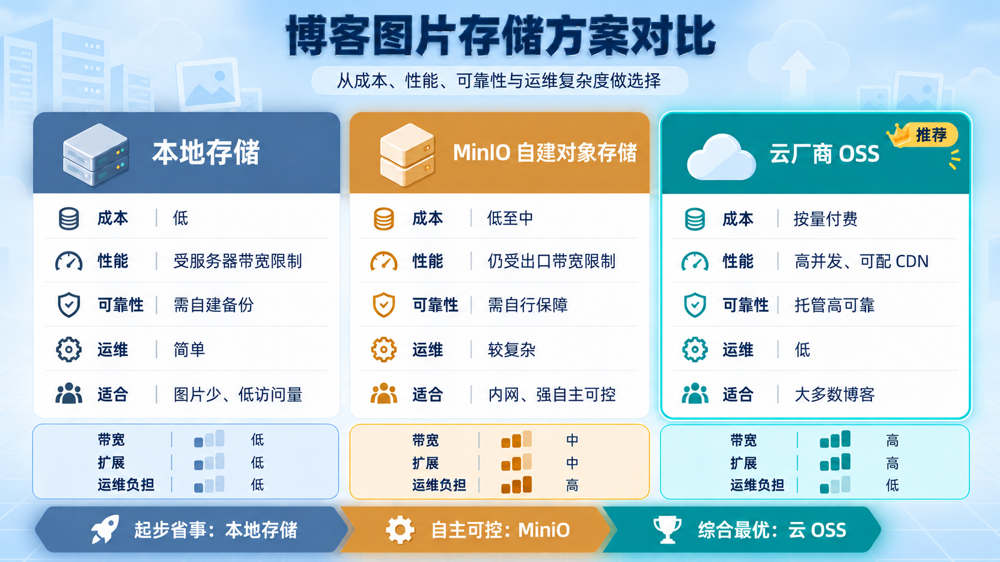
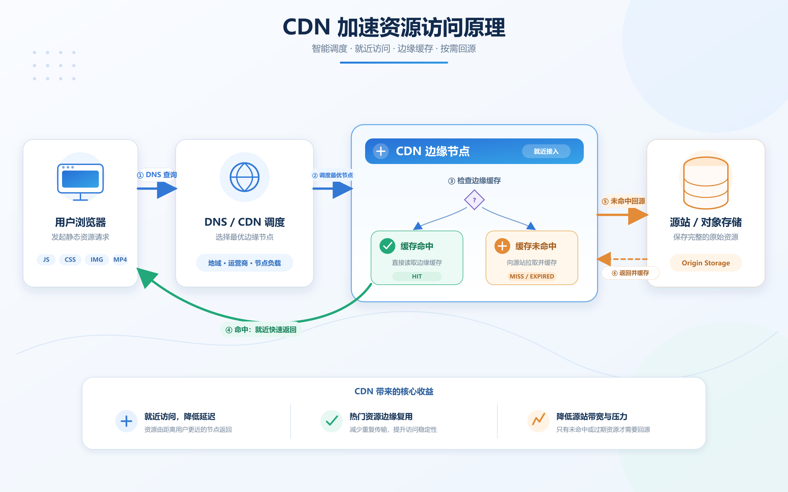
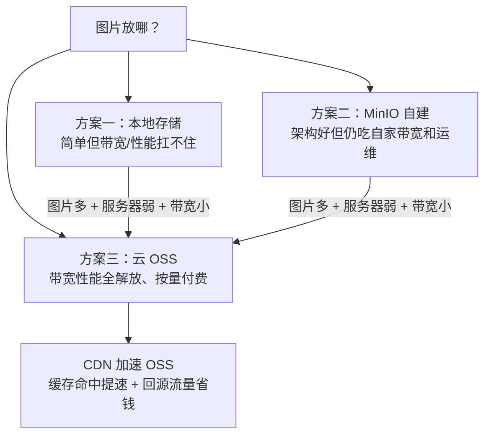
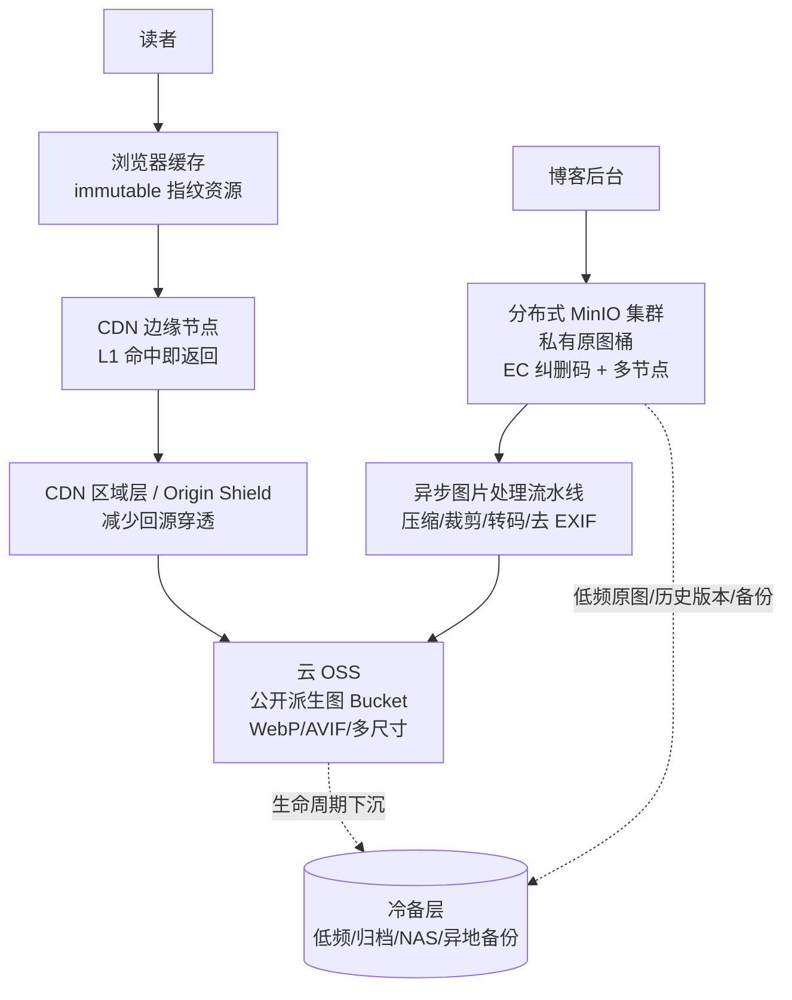

# 博客项目图片资源管理的技术选型：从本地存储到 OSS + CDN



> 在做自己的博客项目时，从博客前台的原型设计中存在的各个部分，是可以看出我是想在浏览的过程中加载很多图片的，比如我的足迹部分、博客文章内容等都会存在不少图片，于是关于这些图片资源的管理成了一个绕不开的问题。本文记录了我在 **本地存储**、**MinIO 自建对象存储**、**云厂商 OSS** 三个方案之间的选型过程，以及最终落地后如何做进一步的性能优化与成本节约。

---

## 一、为什么图片资源需要单独考虑

博客系统的文本内容（Markdown、HTML）体积很小，存在数据库或 Git 仓库里都毫无压力。但图片完全不同：

- **体积大**：一张未经压缩的相机原图动辄 3~10MB，一篇游记类文章可能带几十张图；
- **流量占比高**：页面加载时，80% 以上的流量消耗在图片上；
- **访问模式特殊**：写一次、读多次，基本不需要修改，非常适合"对象存储"的模型；
- **对可用性敏感**：图床挂了，整篇文章就"破相"了。

因此，图片资源的存储方案需要围绕 **容量、带宽、成本、可靠性** 四个维度来做选型。

---

## 二、方案一：本地存储

最简单直接的方式——图片直接放在博客服务器的磁盘上，通过 Nginx 或应用本身以静态资源的形式对外提供访问。

```text
blog-server/
├── app/                # 博客应用
├── uploads/            # 图片目录
│   ├── 2026/08/cover.png
│   └── ...
└── nginx.conf          # 静态资源映射
```

### 优点

1. **零额外成本**：不引入任何第三方服务，服务器买多大磁盘就用多大；
2. **架构最简单**：没有外部依赖，上传、访问逻辑都不需要额外开发；
3. **内网读写快**：图片和应用在同一台机器，写入路径短，没有网络开销；
4. **数据完全自主可控**：不用担心第三方服务的合规、迁移问题。

### 缺点

1. **带宽瓶颈致命**：所有图片流量都从服务器出口走。假设服务器带宽只有 5Mbps（很多低配 VPS 的标配），一张 2MB 的图就能把带宽打满几秒，几个人同时访问页面就会集体转圈；
2. **占用服务器性能**：静态文件请求也要经过 Nginx/应用进程，高并发下会挤占 CPU 和连接数，影响动态接口的响应；
3. **扩容困难**：磁盘写满后需要停机迁移或挂载新盘，扩展性几乎为零；
4. **单点风险**：磁盘损坏 = 图片全丢，需要自己额外做异地备份；
5. **迁移成本高**：图片和业务代码耦合在部署目录里，换服务器、换架构时非常痛苦。

### 小结

本地存储适合 **图片极少、访问量极低** 的个人站点起步期。

---

## 三、方案二：MinIO 自建对象存储

MinIO 是一个开源的、兼容 S3 协议的对象存储服务，可以部署在自己的服务器上，兼顾"对象存储的架构"和"数据的自主权"。



### 优点

1. **架构解耦**：图片与业务代码分离，应用通过标准 S3 SDK 读写，后续迁移到任何 S3 兼容服务都很顺滑；
2. **对象存储特性齐全**：支持 Bucket 管理、预签名 URL、生命周期策略、版本控制等，工程化程度高；
3. **数据自主可控**：数据躺在自己的磁盘上，隐私合规无忧；
4. **开源免费**：没有按量计费，社区活跃，文档完善；
5. **可横向扩展**：MinIO 支持纠删码（Erasure Coding）和多节点分布式部署，理论上可以做得非常可靠。

### 缺点

1. **带宽瓶颈依旧存在**：这是最关键的一点——MinIO 只是把存储"对象化"了，图片流量**依然从自己服务器的出口带宽出去**；
2. **运维成本高**：需要维护 MinIO 服务本身的可用性、监控、升级、磁盘水位告警，出问题自己兜底；
3. **占用本机资源**：MinIO 进程要吃内存和 CPU（官方建议至少 1G 内存），对小内存 VPS 不友好；纠删码模式还要求至少 4 块盘；
4. **可靠性靠自己**：单节点 MinIO 没有副本冗余，磁盘坏了照样丢数据，要做到真可靠就得加机器、加盘，成本迅速上升；

### 小结

MinIO 适合 **有运维能力、带宽充足、对内网服务或数据自主性有强需求** 的场景（比如公司内网图床）。

---

## 四、方案三：云厂商 OSS 对象存储

OSS（Object Storage Service，各大云厂商均有同类产品，如阿里云 OSS、腾讯云 COS、AWS S3、七牛云 Kodo 等）是云厂商提供的托管对象存储服务，按量付费。



### 优点

1. **带宽无限量**：图片流量走云厂商的骨干网络，出口带宽不再受自己服务器的小水管限制，并发再高也扛得住；
2. **服务器零负担**：上传可以通过"服务端签名 + 浏览器直传"完成，图片流量完全不经过应用服务器，CPU、内存、带宽全部解放；
3. **高可靠性**：主流厂商承诺 99.999999999%（11 个 9）的数据持久性和 99.995% 的可用性，多副本/跨区冗余是默认能力；
4. **免运维**：不用关心磁盘、扩容、备份，全部是托管服务；
5. **生态强大**：
   - 图片处理（缩放、裁剪、加水印、转 WebP）一条 URL 参数搞定，连缩略图服务都不用自建；
   - 与 CDN 天然打通，一键开启加速；
   - SDK、CLI、控制台工具齐全。
6. **成本可控**：标准存储单价约 0.12 元/GB/月 量级，个人博客几十 GB 的图片每月存储费只是一杯奶茶钱。

### 缺点

1. **产生持续费用**：存储、流量、请求次数都计费，需要留意账单，防止被恶意盗刷流量（可通过防盗链、用量告警缓解）；
2. **厂商锁定风险**：各家 OSS 的 API 和特性略有差异（好在大多兼容 S3 协议，迁移成本尚可接受）；
3. **依赖网络与厂商可用性**：极端情况下厂商故障或账号问题会影响图片访问；
4. **数据在第三方手中**：对隐私敏感的场景需要评估合规性（博客公开图片则无此顾虑）。

---

## 五、最终决策：为什么选择 OSS



*图 1　三方案对比图*

三个方案放到我博客的实际情况里对比：

| 维度 | 本地存储 | MinIO 自建 | 云 OSS |
| --- | --- | --- | --- |
| 出口带宽压力 | ❌ 全部自己扛 | ❌ 全部自己扛 | ✅ 云厂商骨干网 |
| 服务器性能占用 | ❌ 高 | ⚠️ 中（MinIO 进程） | ✅ 几乎为零 |
| 运维成本 | ✅ 无 | ❌ 高 | ✅ 几乎为零 |
| 可靠性 | ❌ 单点 | ⚠️ 取决于投入 | ✅ 11 个 9 |
| 扩容能力 | ❌ 难 | ⚠️ 手动加节点 | ✅ 无感知 |
| 费用 | ✅ 免费 | ✅ 免费 | ⚠️ 按量付费（小额） |

我的核心约束非常明确：

1. **图片多**：在设计环节就预见会存在大量图片，如果配图持续累积将不适合本地存储；
2. **服务器性能不足**：博客跑在一台 2C2G 的入门 VPS 上，再跑一个 MinIO 进程会和应用抢资源；
3. **带宽受限**：服务器出口带宽只有几 Mbps，图片一多页面就卡顿。

这三条约束直接淘汰了方案一和方案二——它们共同的死穴都是"流量必须经过我的小水管服务器"。而 OSS 恰好把图片的存储、流量、处理全部卸载到云端，服务器只负责它最擅长的动态请求。

> ✅ **结论：选择方案三（云 OSS），图片与服务器彻底解耦。**

---

## 六、性能优化与资源节约一：CDN 加速 OSS

OSS 解决了带宽和运维问题，但还可以更进一步。直接使用 OSS 默认域名访问有两个遗留问题：

- **回源流量计费**：每次访问都产生 OSS 外网流出流量费用；
- **远距离访问延迟**：OSS Bucket 固定在某个地域，离得远的读者加载图片仍然慢。

答案是给 OSS 套一层 **CDN**：



*图 2　CDN 加速资源访问原理图*

### 具体做法

1. **绑定自定义域名**：如 `static.example.com` CNAME 到 CDN 域名，CDN 回源地址指向 OSS Bucket；
2. **配置缓存策略**：图片设置较长的缓存时间（如 30 天），配合文件名 hash 或版本号实现"永久缓存 + 更新失效"；
3. **开启 HTTPS**：CDN 上配置免费证书，全站 HTTPS；
4. **开启防盗链**：将自己的博客网站域名添加进 Referer 白名单，防止图片被第三方站点盗链刷流量；

### 带来的收益

| 收益 | 说明 |
| --- | --- |
| 🚀 **访问提速** | 读者就近命中边缘节点，首图加载时间从秒级降到百毫秒级 |
| 💰 **流量省钱** | CDN 流量单价通常低于 OSS 外网流出单价；且缓存命中后**不再产生 OSS 回源流量**，图片被访问一万次，OSS 可能只回源一次 |
| 🛡️ **源站保护** | OSS  Bucket 隐藏在 CDN 之后，直接攻击和盗刷成本更高 |
| 📉 **请求费下降** | 命中缓存的请求不计入 OSS 请求次数费用 |

对于图片这种**读多写少、内容基本不变**的资源，CDN 的缓存命中率可以轻松做到 90% 以上，是真正的"花小钱办大事"。

## 七、性能优化与资源节约二：浏览器缓存优化

CDN 解决的是"第一次访问"的快慢，但博客的读者大多是回头客——同一个访客反复加载相同的 JS、CSS、字体和图片，如果每次都从网络下载，再快的 CDN 也是浪费。**浏览器缓存（HTTP Cache）**让已下载过的资源直接复用本地副本，是性价比最高的优化：不加硬件、不加服务，只改几个响应头。

### 具体做法

1. **带 hash 的静态资源：长缓存 + immutable**。前端用 Vite 构建，JS/CSS 文件名自动嵌入内容 hash（如 `index-a8f3c2d4.js`）——内容一变，文件名就变，旧缓存自然失效。Nginx 对这类资源直接下发 `Cache-Control: public, max-age=604800, immutable`（7 天），缓存期内浏览器**连协商请求都不会发**：

2. **HTML 入口：绝不长缓存**。`index.html` 是资源的"目录"，必须保持新鲜——否则浏览器拿着旧 HTML 去请求已经不存在的老 hash 文件，页面直接白屏。本项目的做法是让 `index.html` 走默认协商缓存，发版后立刻能引用新 hash 资源；更稳妥的写法是显式加 `Cache-Control: no-cache`，强制浏览器每次都用 ETag 确认。

3. **协商缓存兜底**：`max-age` 过期后，浏览器带上 `If-None-Match`（ETag）问一句"资源变了吗"，没变就回 `304 Not Modified`——只有一个响应头，没有正文，成本几乎为零。

4. **gzip 压缩配套**：JS/CSS/HTML 超过 1KB 即压缩，传输体积再砍 60%~70%，缓存里存的也是压缩后的内容。

### 带来的收益

| 收益 | 说明 |
| --- | --- |
| 🚀 **二次访问秒开** | 回访只下载一个几 KB 的 HTML，其余全部来自本地缓存 |
| 💰 **带宽成本大降** | 静态资源不再重复传输，流量账单直接缩水 |
| 📉 **源站压力骤降** | 缓存命中时请求根本到不了应用，Nginx 直接返回缓存或 304 |
| 🔁 **与 CDN 互补** | CDN 解决"所有人第一次访问慢"，浏览器缓存解决"同一个人第二次及以后" |

对于博客这种**老读者回访占比高**的场景，CDN + 浏览器缓存组合起来，才能做到：新读者快、老读者更快。而这一切的核心只有一句话——**长缓存必须建立在"文件名带 hash"的前提上**，这也正是 Vite 等现代构建工具默认就帮我们做好的事。

---

## 八、总结与展望

这次选型的完整路径：



一句话总结：**小服务器扛不住的流量，就不要硬扛**——把静态资源卸载给 OSS，再用 CDN 把体验和账单同时优化掉。这套 "OSS + CDN" 的组合，基于阿里云的免费使用额度，是我认为目前个人博客图片资源管理性价比最高的答案。

后续展望：如果网站资源的规模与访问流量继续增长，单纯的 "OSS + CDN" 也会遇到新的边界：费用会超出阿里云免费额度，这时该怎么办？我们经常访问的那些大网站都是怎么做的？带着这个疑问试想了一下并询问AI，它对于后续的资源管理给出的方案是：混合架构 + 分布式 MinIO + 缓存分层。


1. **缓存分层**：形成「浏览器 → CDN L1 → 区域 shield → OSS 派生图 → MinIO 原图/冷备」的多级链路；派生图永久缓存，源图私有，冷门资源自动下沉。目标是让绝大多数请求死在边缘。
2. **混合架构**：MinIO 不再直接面向公网，而是作为私有原图库 + 图片处理中枢 + 冷数据仓；公网分发仍由 OSS + CDN 承担。
3. **分布式 MinIO**：从单节点过渡到多节点纠删码部署，重点保障原图可靠性；应用层继续用统一 S3 SDK 访问，后续替换存储后端时不改业务代码。
4. **生命周期与成本治理**：临时上传、失败任务、历史版本、孤儿派生图自动清理；热图走标准存储，冷原图低频/归档；账单按 Bucket/前缀/业务线拆分，配合命中率和异常流量告警持续调优。

这个方案就当挖一个坑吧，希望后续有机会能写一篇文章去实践并记录这个方案。😝
