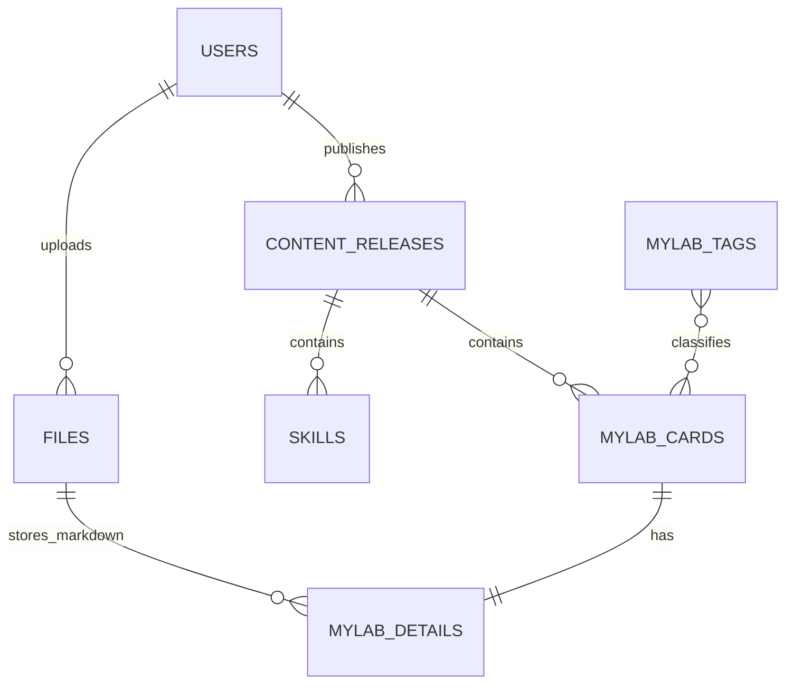

# 后端工作流之数据库设计：从需求到 DDL 的完整流程

> 以我的个人博客项目为例，完整走一遍数据库设计的工作流。重点不是"画了几张表"，而是**每一步为什么这么做**。

## 前言：为什么数据库设计需要一个独立的工作流

在我vibe coding的项目里，我对于AI设计的后端数据库表结构的设计经常不是很满意，比如我这个博客项目最开始关于设计的如何来管理各个部分如我的足迹，做过的项目等，AI它只用一张表管理，是这样的：

| 字段 | 说明 |
| --- | --- |
| `module_key` | （VARCHAR）模块标识（skills / footprints / mylab / …） |
| `draft_data` | （JSONB）下线数据 |
| `published_data` | （JSONB）发布数据 |
| `state` | `DRAFT / PUBLISHED / ARCHIVED / OFFLINE` ||
| `draft_version` | 版本号 |
| `published_version` | 版本号 |
| `created_at` | 创建时间 |
| `updated_at` | 更新时间 |
| `published_by` / `published_at` | 发布人和发布时间 |

不知为何采用了JSONB来管理页面的具体数据，这个字段的数据又臭又长，我也并没有强制要求AI去用json格式去存数据，以AI的能力（GPT-5.6）不应该设计出这样的字段，去询问它，也只能得到一句：你说的对！.....

而且在分表以及表结构的设计上经常对不上我的需求，在进行项目修改的时候，还有表的表结构像是"长"出来的：经常写接口的时候发现缺个字段就加一列，做到新功能就随手建张表，导致migration下经常有一长串sql脚本。

基于以上的问题，我打算完善在后端数据库设计上的自己的工作流，一是更加完整的学习了解整个后端开发的流程，深入其中的细节，二是更好的控制AI，让我和AI的关系避免变成像“猴子打字机”。所以我写下了这篇文章，做一记录。

---

## 第 0 步：明确需求与设计边界

**做什么**：在画任何一张表之前，先把需求来源和设计范围写清楚。

**具体动作**：

1. 完成前端页面原型设计和 API 文档，列出所有"需要被持久化"的信息；
2. 明确哪些信息**不**进数据库（比如纯静态的 UI 文案、按钮跳转地址），确定好数据的前端和后端管理的分界；
3. 写下设计范围的约束，前期可以先只做表、字段和必要约束，索引优化和性能验收另开一轮。

**为什么这么做**：

- 这个博客项目我是先完成的前端，看前端做的差不多了，觉得这个项目比较小就直接跳过了API文档设计这一环节，只提了后端需要管理哪些重要的数据就让AI开干了，结果就如前面所说。回头看AI的执行步骤，虽然最后也有生成一个API文档，但是这个文档却是在后端代码完成之后才写的，API文档设计这一环节就直接失去了意义，这次的经历算是反面教训。
- 在AI设的数据库表结构中出现了不应该保存进数据库的内容，如博客前台页面的大标题，按钮的跳转地址。虽然大标题和描述相关内容能统一抽象出来，但是我认为并不是什么数据都需要后端数据库管理；按钮的跳转地址我也没有提但还是入库了，像是产生了幻觉；不过它们根因都一样：**没有确立好边界**，明确"什么不进库"和"什么进库"同样重要。
- 这个第3个动作属于我的个人能力有限，没办法在一开始就做到尽善尽美，在需求完善的过程中要加入考虑优化等环节会导致项目进度缓慢，需要思考的东西一下跳到另一层，干脆选择先从简开始。

---

## 第 1 步：概念设计——画 ER 图与定设计规范

**做什么**：在正式建表之前，先用 ER 图把实体和关系画出来。

**具体动作**：

1. 定好全局一致的表设计规范，如按照三范式设计（1、原子性，每列不可再生 2、非主键字段必须依赖全部主键 3、非主键字段不能依赖其他非主键字段），若有反范式设计必须写出理由
2. 在全局一致的设计规范中敲定关键细节，如每张表必须有通用的时间字段与软删除字段，所有的主键必须使用UUID而不是自增ID；
3. 做好上述操作后，并参照API文档，就可以开始画ER图。

**为什么这么做**：

- 我先前的问题会出现也是因为数据库表没有按照三范式设计导致的，但如果严格按照三范式设计由于原子性的要求会出现大量冗余的表，关于这部分设计的边界就需要人去做决定了，所以给出适当的理由，可以保留一些反范式设计
- 通用字段如时间字段等AI设计中一般都会有，但软删除字段不提出来一般不会设计，因此这部分需要多留意
- 画图能厘清自己的思路，也能解决一些文字需求里含糊的问题，更重要的是让AI理解需求的边界，能避免产生更多失误与不必要的幻觉

---

## 第 2 步：逻辑设计——更具体的业务层面设计

**做什么**：参考前面的ER图与设计规范，让AI去设计更贴近业务层面的表。

这一步是工作量最大的部分：把每个实体展开成表，逐字段定类型和约束。挑几个有代表性的决策说明。

### 3.1 按"变化频率"和"编辑场景"拆表

本项目把六个内容模块（`support_stats`、`skills`、`footprints`、`hobbies`、`vibe_tools`、MyLab 三表）拆成独立业务表，而不是搞一张 `contents(module, payload)` 大宽表。

**为什么**：不同模块的字段结构、校验规则、编辑入口完全不同。强行用一张表加 JSON 载荷，等于把 schema 校验从数据库推到应用层，每张"虚拟表"的约束都要手写代码维护，报表和排查问题也极不方便。表便宜，混乱贵。

### 3.2 刻意反范式：数组和 JSONB 进主表

本项目明确允许：

- `footprints.paragraphs` 用 `TEXT[]` 存城市详情段落；
- `footprints.images`、`mylab_cards.project_images` 用 JSONB 存图片数组；
- `mylab_cards.tag_ids` 用 `UUID[]` 存标签引用。

对应的，设计文档里列出了**明确取消**的一串子表：`footprint_paragraphs`、`footprint_images`、`project_paragraphs`、`project_images`、`mylab_post_tags`……

**为什么敢反范式**：判断是否拆子表，看三个问题——

1. 子项会被独立查询或更新吗？（段落只会跟随城市整体读写 → 不拆）
2. 子项会被多个父级共享吗？（标签被多张卡片共享 → 标签本身独立成表，但关联关系不必拆）
3. 子项数量会无界增长吗？（一个城市的段落最多几段 → 不拆）

三个答案都是"不"，拆子表带来的就只有 join 成本和迁移成本。PostgreSQL 的数组和 JSONB 是一等公民，够用且好用。

### 3.3 字段类型的选择

- `TIMESTAMPTZ` 而不是 `TIMESTAMP`：带时区，服务器迁移、跨国访问不会出"时间整体偏移 8 小时"的经典事故。除非有极强理由，时间字段一律 `TIMESTAMPTZ`。
- `VARCHAR(n)` 给出明确长度（如 `VARCHAR(64)`），不是 `TEXT` 一把梭：长度约束是数据库能帮你的最后一道数据质量防线，也逼着你在设计时想清楚"这个字段到底存什么"。真正的长文本（摘要、正文引用）才用 `TEXT`。
- `SMALLINT` 存百分比并加 `0..100` 检查约束、`BIGINT` 存计数并加 `>= 0`：让不可能的数据**物理上无法落库**。
- 正文 Markdown 和图片二进制**不入库**，只存 OSS 文件引用（`markdown_file_id` → `files.object_key`）：数据库不适合当文件系统，大字段会撑爆 Buffer Pool、拖慢备份。库里的 `content_etag` 字段用来做缓存失效判断，这是"引用 + 校验"而不是"内容本体"。

---

## 第 4 步：核心业务建模——发布流程单独成表

本项目最核心的一张表不是任何内容表，而是 `content_releases`：

| 字段 | 说明 |
| --- | --- |
| `module_key` | 模块标识（skills / footprints / mylab / …） |
| `version_no` | 版本号 |
| `state` | `DRAFT / PUBLISHED / ARCHIVED / OFFLINE` |
| `source_release_id` | 回滚或复制的来源版本 |
| `published_by` / `published_at` | 发布人和发布时间 |

所有内容表通过 `release_id` 外键挂到某个版本上。

**为什么这么设计**：

- **草稿和线上数据必须隔离**。没有版本概念时，后台编辑直接改线上数据，改到一半全站可见。引入 release 后，编辑发生在 `DRAFT` 版本，发布只是切换版本状态，前台永远只读 `PUBLISHED` 版本。
- **状态切换代替数据复制**。发布、下线、回滚全部是对 `state` 字段的状态机操作（回滚靠 `source_release_id` 找到旧版本重新激活），不需要把内容复制来复制去，也就不会有"复制漏了某个字段"的 bug。
- **`content_releases` 不保存业务 JSON**。把六类模块的内容塞进一张发布表的 JSON 字段，看似"通用"，实则丢掉了全部类型约束，也让按模块查询变成 JSON 解析。发布表只管流程元数据，内容表只管内容，关注点分离。

**配套的业务约束**也写进了设计：

- `(module_key, version_no)` 唯一；
- 一个模块最多一个有效草稿、最多一个当前发布/下线版本；
- 发布版本必须填 `published_by` 和 `published_at`。

注意最后两条这类"全局唯一一个"的约束，靠数据库唯一索引很难干净表达（部分唯一索引在 PostgreSQL 里可以做，但要配合软删除条件，比较绕），这类约束放应用层校验更诚实——这就是下一步要谈的边界问题。

---

## 第 5 步：约束设计——数据库约束与应用层校验的边界

**做什么**：逐个字段、逐个关系决定约束放在哪一层。

**判断原则**：

- 数据库约束（PK、FK、UNIQUE、CHECK、NOT NULL）放**能机械判定、永不例外**的规则：主键唯一、用户名唯一、百分比 0~100、计数非负。
- 应用层校验放**需要上下文、会跨多行多表、或业务上可能调整**的规则。

本项目的典型例子：`mylab_cards.tag_ids` 是 `UUID[]`，数组元素无法用外键逐项约束。所以"标签必须属于同一 release、必须存在且启用、不能重复引用"这三条全部放在后端保存/发布时校验。

另一个例子："最多启用 5 张爱好卡片""同一发布版本最多 6 张首页项目卡片"——这类**配额型规则本质是业务策略**，今天 5 张明天可能 8 张，写死在数据库里每次调整都要做迁移，放应用层。

**为什么边界要想清楚**：约束放错层的代价是不对称的——本该在库里的约束放到应用层，脏数据早晚会绕过代码进来；本该在应用层的规则硬塞进数据库，每次业务微调都要写迁移脚本。宁可保守一点：拿不准就先放应用层，等规则稳定了再下沉。

---

## 第 6 步：取舍与简化——敢于删掉设计

**做什么**：设计稿完成后，专门做一轮"减法评审"。

本项目这轮评审的成果（都是**砍掉**的东西）：

- 取消 `projects` 表：项目卡片、项目侧边栏、MyLab 卡片统一由 `mylab_cards` 承载，用 `show_in_projects` 标志区分；
- 取消 `visit_sessions`、`visit_counters`：访问量按 `ip + 日期` 从 `visit_logs` 现算，小数据量不需要汇总表；
- 取消 `content_modules`、`content_publications` 等与 `content_releases` 职责重叠的表。

**为什么减法值得单独一步**：

- 每张表都是长期负债：实体类、Mapper、迁移脚本、校验代码、文档，全生命周期成本。三张表表达的概念如果能用一张表加标志位表达清楚，就不要三张。
- 但也要守住底线：`mylab_cards` 里项目专属字段（`project_detail_title` 等）约定"非项目卡片必须为空"——合并表的前提是有明确的字段使用契约，否则宽表会变成"什么都有、什么都说不清"的垃圾场。
- 不做预支的优化。汇总计数表是"将来数据量大再加"的东西，现在加只会让每次访问多一次写放大。**按当前规模设计，为未来留好演进路径**（比如 `visit_logs` 保留原始明细，以后随时能离线汇总回填），比一步到位更重要。

---

## 第 7 步：落地——DDL 与迁移管理

**做什么**：把设计变成可执行、可重复、可回放的脚本。

具体动作：

1. 启用必要扩展：`CREATE EXTENSION IF NOT EXISTS "uuid-ossp";`
2. 按依赖顺序写建表 DDL：基础表（`users`、`files`）→ 发布表（`content_releases`）→ 内容表（挂在 release 上）；
3. 所有 DDL 纳入 Flyway 版本化迁移（`V1__init.sql`、`V2__xxx.sql`……），禁止手工连库改结构；
4. 表清单和取消清单写回设计文档（本项目最终 12 张表），作为评审存档。

**为什么用 Flyway 而不是"口头同步"**：数据库结构是代码的一部分，必须和代码一样可版本化、可 review、可重现。任何人 clone 项目后 `mvn spring-boot:run` 就能把库建到和线上一致的版本，这是团队协作（哪怕团队只有你一个人，三个月后的你也是协作者）的底线。

---

## 第 8 步：评审与迭代

**做什么**：设计不是一次成型的，至少安排两轮检查：

- **自查**：拿 API 文档逐个接口过一遍——这个接口需要的数据，从表里能不能一次（或合理次数内）查出来？反过来，表里每个字段，有没有接口会写它、读它？查不到的字段就是死字段，删掉或补齐需求。
- **交叉评审**：重点挑战三类东西——删掉的东西是不是真不需要（第 6 步），留下的反范式是不是真有依据（第 3 步），约束是不是放对了层（第 5 步）。

设计文档里"明确取消以下表"的清单，就是迭代留下的痕迹。保留它很重要：后来者（包括未来的你）看到取消清单，就不会再把 `mylab_post_tags` 加回来。

---

## 总结：一份可以复用的检查清单

走完整个流程，沉淀下来的检查项：

1. 设计范围和数据规模预期写在文档开头了吗？
2. 有没有明确列出"不进数据库"的内容？
3. ER 图画了吗，关系基数（1:1 / 1:N / M:N）确认过吗？
4. 主键策略、时间字段、软删除，全局约定统一吗？
5. 拆表是按变化频率和编辑场景拆的吗？
6. 每一处反范式（数组 / JSONB / 宽表）能回答那三个判断问题吗？
7. 时间字段是 `TIMESTAMPTZ` 吗？字段长度和 CHECK 约束给全了吗？
8. 大文件 / 长正文是不是只存引用不入库？
9. 草稿与线上的隔离有方案吗（版本 / 状态机）？
10. 每条约束都说得出"为什么在数据库层 / 为什么在应用层"吗？
11. 做过一轮减法评审吗？砍掉的东西留档了吗？
12. DDL 全部版本化管理了吗？

数据库设计的本质，是在**写入便利性、查询便利性、数据一致性、演进灵活性**四者之间做权衡。上面这个流程不能保证你一次设计出完美的 schema，但能保证每个权衡都是**有意识做出来的**，而不是三个月后踩坑时才发现的。

---

*参考实现：本博客项目完整表结构见同目录《数据库表结构重设计.md》。*
