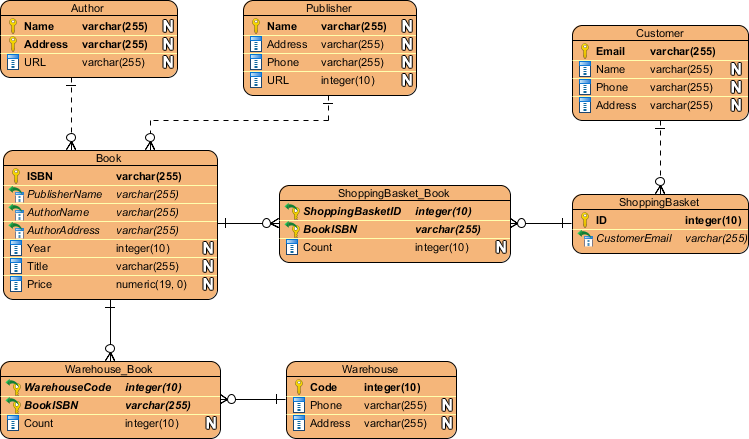

# 后端工作流：数据库表设计

> 以我的个人博客项目为例，完整走一遍数据库表设计的工作流。重点不是"画了几张表"，而是**每一步为什么这么做**。

## 前言：为什么数据库设计需要一个独立的工作流

在我vibe coding的项目里，我对于AI设计的后端数据库表结构的设计经常不是很满意，比如我这个博客项目最开始关于设计的如何来管理各个部分如我的足迹，做过的项目等，AI它只用一张表管理，是这样的：

| 字段 | 说明 |
| --- | --- |
| `module_key` | （VARCHAR）模块标识（skills / footprints / mylab / …） |
| `draft_data` | （JSONB）下线数据 |
| `published_data` | （JSONB）发布数据 |
| `state` | `DRAFT / PUBLISHED / ARCHIVED / OFFLINE` ||
| `draft_version` | 版本号 |
| `published_version` | 版本号 |
| `created_at` | 创建时间 |
| `updated_at` | 更新时间 |
| `published_by` / `published_at` | 发布人和发布时间 |

不知为何采用了JSONB来管理页面的具体数据，这个字段的数据又臭又长，我也并没有强制要求AI去用json格式去存数据，以AI的能力（GPT-5.6）不应该设计出这样的字段，去询问它，也只能得到一句：你说的对！.....

而且在分表以及表结构的设计上经常对不上我的需求，在进行项目修改的时候，还有表的表结构像是"长"出来的：经常写接口的时候发现缺个字段就加一列，做到新功能就随手建张表，导致migration下经常有一长串sql脚本。

基于以上的问题，我打算完善在后端数据库设计上的自己的工作流，一是更加完整的学习了解整个后端开发的流程，深入其中的细节，二是更好的控制AI，让我和AI的关系避免变成像“猴子打字机”。所以我写下了这篇文章，做一记录。

---

## 第 1 步：明确需求与设计边界

**做什么**：在画任何一张表之前，先把需求来源和设计范围写清楚。

**具体动作**：

1. 完成前端页面原型设计和 API 文档，列出所有"需要被持久化"的信息；
2. 明确哪些信息**不**进数据库（比如纯静态的 UI 文案、按钮跳转地址），确定好数据的前端和后端管理的分界；
3. 写下设计范围的约束，前期可以先只做表、字段和必要约束，索引优化和性能验收另开一轮。

**为什么这么做**：

- 这个博客项目我是先完成的前端，看前端做的差不多了，觉得这个项目比较小就直接跳过了API文档设计这一环节，只提了后端需要管理哪些重要的数据就让AI开干了，结果就如前面所说。回头看AI的执行步骤，虽然最后也有生成一个API文档，但是这个文档却是在后端代码完成之后才写的，API文档设计这一环节就直接失去了意义，这次的经历算是反面教训。
- 在AI设的数据库表结构中出现了不应该保存进数据库的内容，如博客前台页面的大标题，按钮的跳转地址。虽然大标题和描述相关内容能统一抽象出来，但是我认为并不是什么数据都需要后端数据库管理；按钮的跳转地址我也没有提但还是入库了，像是产生了幻觉；不过它们根因都一样：**没有确立好边界**，明确"什么不进库"和"什么进库"同样重要。
- 这个第3个动作属于我的个人能力有限，没办法在一开始就做到尽善尽美，在需求完善的过程中要加入考虑优化等环节会导致项目进度缓慢，需要思考的东西一下跳到另一层，干脆选择先从简开始。

---

## 第 2 步：概念设计——画 ER 图与定设计规范

**做什么**：在正式建表之前，先用 ER 图把实体和关系画出来。

参考ER图 

**具体动作**：

1. 定好全局一致的表设计规范，如按照三范式设计（1、原子性，每列不可再生 2、非主键字段必须依赖全部主键 3、非主键字段不能依赖其他非主键字段），若有反范式设计必须写出理由
2. 在全局一致的设计规范中敲定关键细节，如每张表必须有通用的时间字段与软删除字段，所有的主键必须使用UUID而不是自增ID
3. 每一个实体对象必须是至少是一张表，表的字段设计需要至少满足以下条件：1、设计名称准确表达业务含义布尔值 2、状态值和时间字段保持统一风格 3、避免把多个含义存入同一个字段 
4. 做好上述操作后，并参照API文档，根据需求分析出有多少实体对象，就可以开始画ER图。

**为什么这么做**：

- 我先前的问题会出现也是因为数据库表没有按照三范式设计导致的，但如果严格按照三范式设计由于原子性的要求会出现大量冗余的表，关于这部分设计的边界就需要人去做决定了，所以给出适当的理由，可以保留一些反范式设计
- 通用字段如时间字段等AI设计中一般都会有，但软删除字段不提出来一般不会设计，因此这部分需要多留意
- 画图能厘清自己的思路，也能解决一些文字需求里含糊的问题，更重要的是让AI理解需求的边界，能避免产生更多失误与不必要的幻觉

---

## 第 3 步：逻辑设计——处理表间关系，关注业务层面设计

**做什么**：参考前面的ER图与设计规范，让AI开始去设计更贴近业务层面的数据库表。

**具体动作**：

1. 向AI说明具体需要做的业务，如是否需要进行版本管理等
2. 让AI梳理实体对象与对象之间的关系并建表，对象关系是一对一，则外键加唯一约束；若是一对多，多的一方保存外键；若是多对多则建立中间关联表
3. 让AI定义好数据约束，可以由数据库直接表达的规则，不应只依赖前端或后端校验，若涉及跨表查询、操作阶段或复杂业务流程的规则，则更适合由后端服务校验。
4. 根据AI设计的表结构，最后重新完善ER图并进行审查

**为什么这么做**：

- 这一步可以主要交由AI去完成，结合ER图中提出更多业务层面的需求，避免出现思考的盲区，就博客内容的版本管理这个业务功能，我最初是在对应页面的表上添加版本字段但AI能思考得更加周到，采用新的一张`content_releases`表来进行管理效果更好
- 最后重新画一遍ER图，结合表中的数据约束，可以再判断一下哪些数据适合前端校验，哪些应该后端校验，哪些由数据库之间表达，这部分边界的梳理我通过重画ER图可以看得更直观清晰

这是我画的最后完善的ER图：

.png>)

---

## 第 4 步：索引设计——让查询效率与数据体量相匹配

**做什么**：基于前面完成工作，设计并维护一套高效的索引体系，确保高频查询走索引、写入性能不受损、存储成本可控

**具体动作**：

1. 向AI说明业务场景的查询特征（如哪些页面是高频访问、是否有模糊搜索、时间范围筛选、排序分页等），让AI分析 WHERE、JOIN、ORDER BY、GROUP BY 的字段组合
2. 让AI梳理索引策略：单字段索引用于精确匹配，联合索引覆盖多条件查询（遵循最左前缀原则），唯一索引保障业务唯一性（如 UK）
3. 根据AI设计的索引方案，最后输出索引清单（含索引名、类型、字段、用途说明）并审查；区分好"数据库层索引"与"应用层优化"的边界，避免盲目在数据库堆索引

**为什么这么做**：

- 索引的设计高度依赖业务查询模式，提前向AI说明业务场景（如博客首页按时间倒序、文章详情按ID查、后台按状态筛选），AI才能判断哪些是高频查询路径，避免为低频操作牺牲写入性能
- 联合索引的顺序直接影响命中率，让AI基于"最左前缀原则"设计，可以用一个联合索引覆盖多个查询条件，减少索引数量，降低写入时的维护开销
- 数据库索引不是万能的，模糊搜索 LIKE '%xxx%'、全文检索、复杂统计聚合等场景，数据库索引效果极差，通过审查边界可以及时引入 Redis 等更合适的技术栈，避免过度设计
- 最后输出索引清单并重审，可以直观发现"同一个字段建了单索引又在联合索引里重复出现"这类冗余问题

实际上我感觉我做的东西估计都用不上索引.... _(:з」∠)_

---

## 第 5 步：检查验收——一份可以复用的检查清单

**做什么**：通过多维度审查，确保设计与业务需求完全对齐，最好写成一份检测清单让AI执行

**具体动作**：

1. 需求对齐，对照前面的API文档和ER图逐条验证，确保每个实体有表、每个规则有约束
2. 模拟核心业务流程（创建→审核→发布→归档），确保数据流转顺畅
3. 确保校验责任矩阵已明确，前端校验 / 后端校验 / 数据库约束，各司其职
4. 进行性能预演，高频查询、报表查询 EXPLAIN 验证，识别慢查询风险
5. 对扩展性进行评估（未来 6-12 个月字段膨胀、数据增长、分库分表需求）

---

## 第 N? 步:编写迁移脚本——部署上线后通过新增迁移文件继续演进

**做什么**：在项目整体完成进行部署上线后，表结构应通过 Flyway、Liquibase 等迁移工具管理，而不是手工修改环境数据库。

**迁移脚本应具备**：

- 可重复部署到不同环境；
- 执行顺序明确；
- 已执行脚本不随意修改；
- 新旧版本之间具备数据迁移方案；
- 可以在空数据库中完成初始化。

---

## 总结：

主要内容就这些吧，不是很专业不喜勿喷 _(:з」∠)_，这些主要是尝试一次沉淀自己的工作流，让AI的操作更稳定减少抽卡的次数，也是一次学习记录后续可以持续完善，这些内容后面可以写成一个skills去试试，以上

